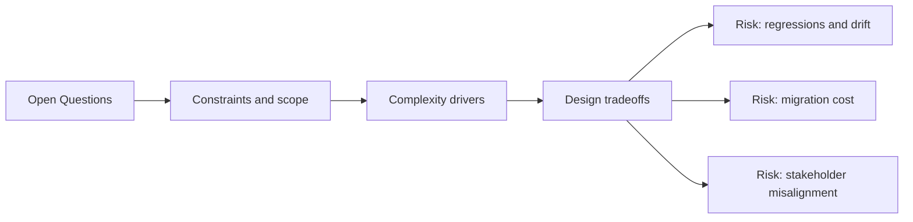

# Open Questions

@Metadata {
  @PageKind(article)
  @PageColor(gray)
  @TitleHeading("Open Questions")
  @PageImage(purpose: icon, source: "system-designs-google-maps-font-system-open-questions-icon.codex", alt: "system-designs-google-maps-font-system-open-questions icon")
  @PageImage(purpose: card, source: "system-designs-google-maps-font-system-open-questions-card.codex", alt: "system-designs-google-maps-font-system-open-questions card")
}

@Options {
  @AutomaticSeeAlso(disabled)
}

Use this page to capture missing details as we refine the system design story.
@Image(source: "system-designs-open-questions-hero.codex", alt: "Open Questions hero")
@Image(source: "system-designs-open-questions-icon.codex", alt: "Legacy open questions icon")
@Image(source: "system-designs-open-questions-card.codex", alt: "Legacy open questions card")
@Image(source: "system-designs-google-maps-font-system-open-questions-hero.codex", alt: "Open Questions hero")

## Resolved Details

- Google Sans for headline/actions, Apple system for 16pt and below.
- API surface: headline (`s`, `m`, `l`), body (`s`, `m`, `l`), text (`s`, `m`).
- Type 2 experimentation cohorts: 1, 5, 10, 50, 100.
- Ten canonical styles loaded into memory with an intermediate cache.
- Cache key: font family + size; eviction on memory warnings.
- Rollback trigger: startup time regressions during Type 2 cohorts.
- Locale fallback validated via simulator overrides; tests ran in Asian
  languages to confirm coverage.
- Snapshot diff threshold set to zero; baselines generated in the cloud.
- Hard constraint: Material 3 tokens needed wrapping instead of direct exposure.

## Architecture

## Data Flows and Interfaces

- What is the exact API signature for requesting a font (token + traits + size
  category)?
  - `import design-system/typography/fonts.h`
  - Use the font loader to request the exact font needed (testable entry point).
  - Objective-C shared API: `TerraTypography.shared.bodyLarge`.
  - New API: `bodySmall`, `bodyMedium`, `bodyLarge`.
  - Material 2 legacy: `body1-5`, `headline1-5`, `text1-5`.
- Should tokens expose a brand channel for Search Results experiments?
  - Yes. Experiments could select a branded typography set without custom
    branching.
  - iPad stayed on the old typography for about one more year, increasing
    split-state complexity.

## Reliability, Scalability, and Performance

- What was the cache key and eviction strategy for the intermediate cache?
  - Cache key: font family + font size.
  - Eviction on memory warnings.
- Were any layout or rendering regressions observed beyond “baseline OK”?
  - Certain screens required disabling `clipToBounds` to accommodate very tall
    Google Sans ascenders. Not ideal, but necessary.
- How did scroll FPS change on Search Results under max Dynamic Type?
  - N/A.

## Testing and Validation

- Which snapshot suites were mandatory before rollout gates?
  - All suites. 100k+ screenshots across every feature surface (location-sharing,
    navigation, transit, placesheet, and more).
- How were Dynamic Type sizes validated across screens?
  - Follow-up required due to the size of the tooling change.
- Did we standardize a Search Results golden dataset for snapshot diffs?
  - Snapshot diffs were used; multilingual variants made standardization hard.

## Migration and Rollout

- What was the rollback trigger during the two-month experiment?
- Which cohort gates were used for the Search Results flag?

## Metrics and Results

- What were the measurable deltas (diff volume, crash-free, perf)?
- Which metrics gates decided progression between rollout stages?

## Security, Privacy, and Compliance

- Confirm whether this was not applicable, or list any policy requirements.

## Diagram: Context Snapshot

@Image(source: "system-designs-google-maps-font-system-open-questions-context.mermaid", alt: "Context snapshot")

