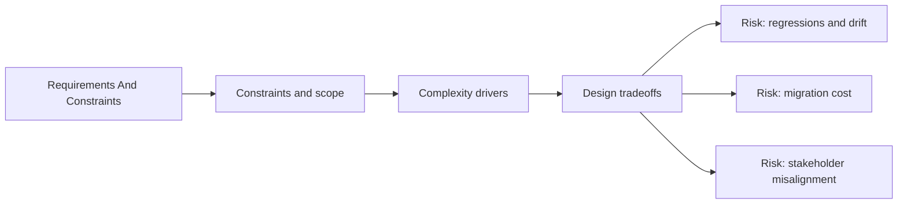

# Requirements and Constraints

@Metadata {
  @PageKind(article)
  @PageColor(gray)
  @TitleHeading("Requirements And Constraints")
  @PageImage(purpose: icon, source: "system-designs-google-maps-font-system-requirements-and-constraints-icon.codex", alt: "system-designs-google-maps-font-system-requirements-and-constraints icon")
  @PageImage(purpose: card, source: "system-designs-google-maps-font-system-requirements-and-constraints-card.codex", alt: "system-designs-google-maps-font-system-requirements-and-constraints card")
}

@Options {
  @AutomaticSeeAlso(disabled)
}

@Image(source: "system-designs-requirements-and-constraints-hero.codex", alt: "Requirements And Constraints hero")
@Image(source: "system-designs-requirements-and-constraints-icon.codex", alt: "Legacy requirements icon")
@Image(source: "system-designs-requirements-and-constraints-card.codex", alt: "Legacy requirements card")
@Image(source: "system-designs-google-maps-font-system-requirements-and-constraints-hero.codex", alt: "Requirements And Constraints hero")

## Requirements

- Experimentation was required to validate the migration plan.
- Typography token rules were provided by the Material Design toolchain.
- The long-term accessibility goal was Dynamic Type parity across the app.
- Distinct Google Sans was required for action buttons and headline text.
- Apple system fonts remained the standard for 16-point text and below.
- Locale fallback chains were not required because Google Sans covered glyphs
  for supported locales and the app did not ship to China.
- Search Results had to be validated at max Dynamic Type sizes.
- Google Sans was required for the Search bar to reinforce brand identity.

## Constraints

- The system had to support four years of OS versions and device classes.
- The migration needed to be reversible during the experimentation window.
- Performance budgets for scroll-heavy screens could not regress.

## Diagram: Context Snapshot

@Image(source: "system-designs-google-maps-font-system-requirements-and-constraints-context.mermaid", alt: "Context snapshot")

