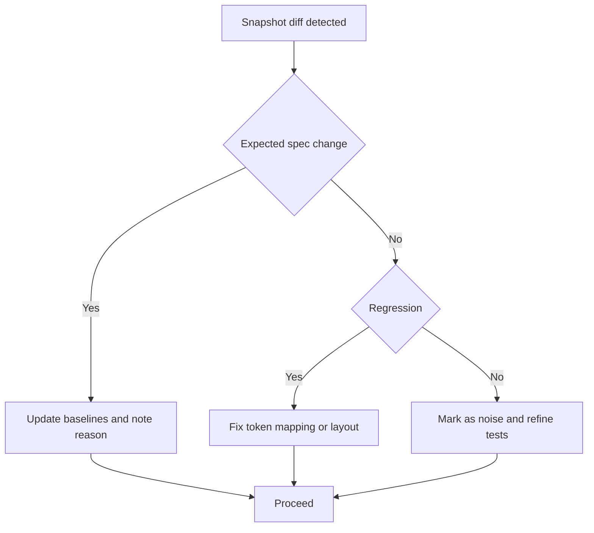

# Rollout and Results

@Metadata {
  @PageKind(article)
  @PageColor(gray)
  @TitleHeading("Rollout and Results")
  @PageImage(purpose: icon, source: "system-designs-google-maps-font-system-rollout-and-results-icon.codex", alt: "Rollout and results icon")
  @PageImage(purpose: card, source: "system-designs-google-maps-font-system-rollout-and-results-card.codex", alt: "Rollout and results card")
}

@Options {
  @AutomaticSeeAlso(disabled)
}

@Image(source: "system-designs-google-maps-font-system-rollout-and-results-hero.codex", alt: "Rollout and results hero")

## Rollout

- Staged by shared components, then feature surfaces.
- Feature‑flagged with rollback controls.
- Monitored via layout diffs and performance metrics.
- Rollback trigger: startup time regressions during Type 2 cohorts.

## Results

- Typography changes became predictable and reversible.
- Visual drift dropped across the app surface.
- Teams gained a single, shared language for type roles.
- Style inventory dropped from roughly 15 styles to about 10.
- Search Results shipped the new mapping with no max-size truncation regressions.
- Performance held at baseline with no regression signals.

## Metrics and Signals

- Crash-free sessions during staged rollouts.
- Snapshot diff volume and regression counts.
- Snapshot diff threshold set to zero.
- Dynamic Type parity checks at maximum sizes.
- Text layout performance in scroll-heavy screens.
- Scroll FPS and text layout time for Search Results before and after the flag.

## Diagram: Snapshot Triage Loop

@Image(source: "maps-font-snapshot-triage.mermaid", alt: "Snapshot triage loop")

