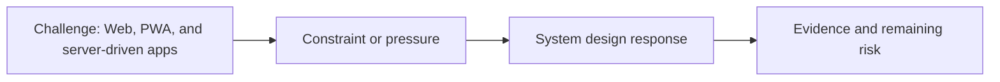

# Web, PWA, and Server-driven Apps

@Metadata {
  @PageKind(article)
  @PageColor(gray)
  @PageImage(purpose: icon, source: "ios-scaling-challenges-29-web-pwa-and-server-driven-apps-icon.codex", alt: "Web, PWA, and server-driven apps icon")
  @PageImage(purpose: card, source: "ios-scaling-challenges-29-web-pwa-and-server-driven-apps-card.codex", alt: "Web, PWA, and server-driven apps card")
}

@Image(source: "ios-scaling-challenges-29-web-pwa-and-server-driven-apps-hero.codex", alt: "Web, PWA, and server-driven apps hero")

This page records how the Google Maps typography system addressed "Web, PWA, and server-driven apps".

## Challenge

Web teams handled these APIs for server-driven and web surfaces.

## System Design Response

We rejected this path due to performance.

## Evidence and Remaining Risk

N/A.
## Diagram: Context Snapshot

@Image(source: "system-designs-google-maps-font-system-scaling-challenges-challenge.cross-platform.web-pwa-and-server-driven-apps-context.mermaid", alt: "Context snapshot")

