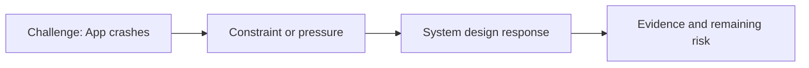

# App Crashes

@Metadata {
  @PageKind(article)
  @PageColor(gray)
  @PageImage(purpose: icon, source: "ios-scaling-challenges-06-app-crashes-icon.codex", alt: "App crashes icon")
  @PageImage(purpose: card, source: "ios-scaling-challenges-06-app-crashes-card.codex", alt: "App crashes card")
}

@Image(source: "ios-scaling-challenges-06-app-crashes-hero.codex", alt: "App crashes hero")

This page records how the Google Maps typography system addressed "App crashes".

## Challenge

We needed robust system metrics at key entry points to catch crash regressions.

## System Design Response

We used a crash metric dashboard to track entry-point stability.

## Evidence and Remaining Risk

Prior crashes happened at boot time, sometimes from unset experiment variables,
incorrect enums, or ARC early deallocation.
## Diagram: Context Snapshot

@Image(source: "system-designs-google-maps-font-system-scaling-challenges-challenge.ios-app-nature.app-crashes-context.mermaid", alt: "Context snapshot")

