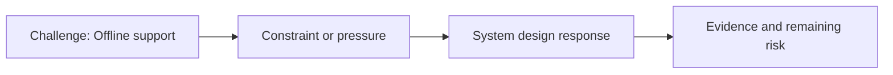

# Offline Support

@Metadata {
  @PageKind(article)
  @PageColor(gray)
  @PageImage(purpose: icon, source: "ios-scaling-challenges-07-offline-support-icon.codex", alt: "Offline support icon")
  @PageImage(purpose: card, source: "ios-scaling-challenges-07-offline-support-card.codex", alt: "Offline support card")
}

@Image(source: "ios-scaling-challenges-07-offline-support-hero.codex", alt: "Offline support hero")

This page records how the Google Maps typography system addressed "Offline support".

## Challenge

Offline behavior required a safe fallback path. We needed a way to keep the
system stable even when the new font configuration could not be fetched.

## System Design Response

We cached the experiment setting and kept using it until the app was removed.
On first boot we defaulted to the old font system as a safety fallback in case
of crashes or missing configuration.

## Evidence and Remaining Risk

Evidence: offline by default ensured the old font system remained the safe path
until configuration could be fetched.
## Diagram: Context Snapshot

@Image(source: "system-designs-google-maps-font-system-scaling-challenges-challenge.ios-app-nature.offline-support-context.mermaid", alt: "Context snapshot")

