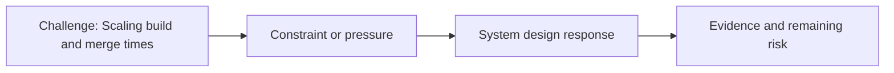

# Scaling Build and Merge Times

@Metadata {
  @PageKind(article)
  @PageColor(gray)
  @PageImage(purpose: icon, source: "ios-scaling-challenges-23-scaling-build-and-merge-times-icon.codex", alt: "Scaling build and merge times icon")
  @PageImage(purpose: card, source: "ios-scaling-challenges-23-scaling-build-and-merge-times-card.codex", alt: "Scaling build and merge times card")
}

@Image(source: "ios-scaling-challenges-23-scaling-build-and-merge-times-hero.codex", alt: "Scaling build and merge times hero")

This page records how the Google Maps typography system addressed "Scaling build and merge times".

## Challenge

This was the hardest. The Google monorepo requires consistency from request
creation through merge, so any file change during the long approval window
forced test cases to re-run. Following the default recommended flow caused
screenshot outputs to disappear.

## System Design Response

We built a refactor tool that used the alternative permanent path. That meant
choosing the less-supported of two version control systems to preserve
screenshots.

## Evidence and Remaining Risk

Evidence: we maintained consistency in screenshots through the migration.
## Diagram: Context Snapshot

@Image(source: "system-designs-google-maps-font-system-scaling-challenges-challenge.large-ios-teams.scaling-build-and-merge-times-context.mermaid", alt: "Context snapshot")

