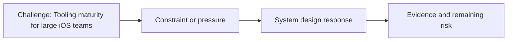

# Tooling Maturity for Large iOS Teams

@Metadata {
  @PageKind(article)
  @PageColor(gray)
  @PageImage(purpose: icon, source: "ios-scaling-challenges-22-tooling-maturity-for-large-ios-teams-icon.codex", alt: "Tooling maturity for large iOS teams icon")
  @PageImage(purpose: card, source: "ios-scaling-challenges-22-tooling-maturity-for-large-ios-teams-card.codex", alt: "Tooling maturity for large iOS teams card")
}

@Image(source: "ios-scaling-challenges-22-tooling-maturity-for-large-ios-teams-hero.codex", alt: "Tooling maturity for large iOS teams hero")

This page records how the Google Maps typography system addressed "Tooling maturity for large iOS teams".

## Challenge

With many teams and many test harnesses, upgrading everyone to the latest
tooling was too costly. The number of harnesses and ownership boundaries made
uniform adoption unrealistic during the typography migration.

## System Design Response

We coordinated with teams to review and fix test-harness code rather than
forcing a full upgrade to the latest tooling.

## Evidence and Remaining Risk

Remaining risk: concurrent tests still surfaced harness gaps that required
follow-up fixes.
## Diagram: Context Snapshot

@Image(source: "system-designs-google-maps-font-system-scaling-challenges-challenge.large-ios-teams.tooling-maturity-for-large-ios-teams-context.mermaid", alt: "Context snapshot")

