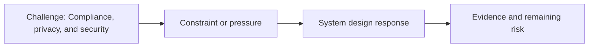

# Compliance, Privacy, and Security

@Metadata {
  @PageKind(article)
  @PageColor(gray)
  @PageImage(purpose: icon, source: "ios-scaling-challenges-36-compliance-privacy-and-security-icon.codex", alt: "Compliance, privacy, and security icon")
  @PageImage(purpose: card, source: "ios-scaling-challenges-36-compliance-privacy-and-security-card.codex", alt: "Compliance, privacy, and security card")
}

@Image(source: "ios-scaling-challenges-36-compliance-privacy-and-security-hero.codex", alt: "Compliance, privacy, and security hero")

This page records how the Google Maps typography system addressed "Compliance, privacy, and security".

## Challenge

We needed legal approval on certain font weights and minimum sizes.

## System Design Response

We worked with lawyers to confirm compliance for ad fonts.

## Evidence and Remaining Risk

Evidence: we passed legal reviews for the new weights and minimum sizes.
## Diagram: Context Snapshot

@Image(source: "system-designs-google-maps-font-system-scaling-challenges-challenge.practice-and-maturity.compliance-privacy-and-security-context.mermaid", alt: "Context snapshot")

