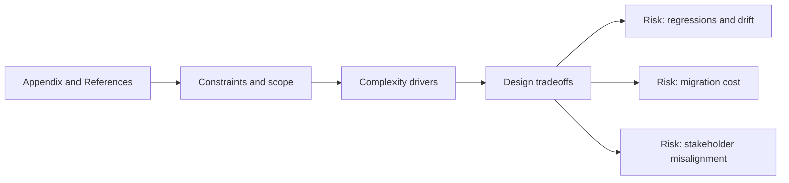

# Appendix and References

@Metadata {
  @PageKind(article)
  @PageColor(gray)
  @TitleHeading("Appendix and References")
  @PageImage(purpose: icon, source: "system-designs-system-design-dimensions-icon.codex", alt: "Appendix and References icon")
  @PageImage(purpose: card, source: "system-designs-system-design-dimensions-card.codex", alt: "Appendix and References card")
}

@Options {
  @AutomaticSeeAlso(disabled)
}

@Image(source: "system-designs-system-design-dimensions-hero.codex", alt: "Appendix and References hero")

Collect supporting artifacts without interrupting the narrative.

## Include

- Links to specs, docs, or tickets.
- Glossary and terminology.

## Diagram: Context Snapshot

@Image(source: "system-designs-system-design-dimensions-dimensions-appendix-and-references-context.mermaid", alt: "Context snapshot")

