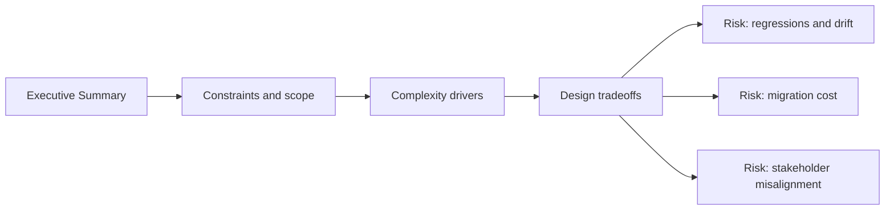

# Executive Summary

@Metadata {
  @PageKind(article)
  @PageColor(gray)
  @TitleHeading("Executive Summary")
  @PageImage(purpose: icon, source: "system-designs-system-design-dimensions-icon.codex", alt: "Executive Summary icon")
  @PageImage(purpose: card, source: "system-designs-system-design-dimensions-card.codex", alt: "Executive Summary card")
}

@Options {
  @AutomaticSeeAlso(disabled)
}

@Image(source: "system-designs-system-design-dimensions-hero.codex", alt: "Executive Summary hero")

A one-page narrative that states the problem, the solution, and the measurable
impact.

## Include

- Problem and who it hurt.
- What changed in the system.
- Outcomes with before/after metrics.

## Skip

- Detailed architecture or full decision logs.

## Diagram: Context Snapshot

@Image(source: "system-designs-system-design-dimensions-dimensions-executive-summary-context.mermaid", alt: "Context snapshot")

