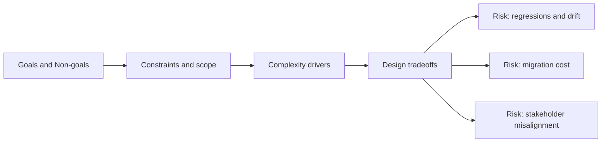

# Goals and Non-goals

@Metadata {
  @PageKind(article)
  @PageColor(gray)
  @TitleHeading("Goals and Non-goals")
  @PageImage(purpose: icon, source: "system-designs-system-design-dimensions-icon.codex", alt: "Goals and Non-goals icon")
  @PageImage(purpose: card, source: "system-designs-system-design-dimensions-card.codex", alt: "Goals and Non-goals card")
}

@Options {
  @AutomaticSeeAlso(disabled)
}

@Image(source: "system-designs-system-design-dimensions-hero.codex", alt: "Goals and Non-goals hero")

Define what success means and what was explicitly out of scope.

## Include

- Success criteria and target metrics.
- Non-goals that prevented scope creep.
- Tradeoffs implied by those boundaries.

## Diagram: Context Snapshot

@Image(source: "system-designs-system-design-dimensions-dimensions-goals-and-non-goals-context.mermaid", alt: "Context snapshot")

