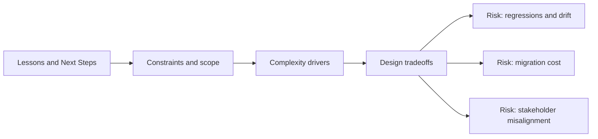

# Lessons and Next Steps

@Metadata {
  @PageKind(article)
  @PageColor(gray)
  @TitleHeading("Lessons and Next Steps")
  @PageImage(purpose: icon, source: "system-designs-system-design-dimensions-icon.codex", alt: "Lessons and Next Steps icon")
  @PageImage(purpose: card, source: "system-designs-system-design-dimensions-card.codex", alt: "Lessons and Next Steps card")
}

@Options {
  @AutomaticSeeAlso(disabled)
}

@Image(source: "system-designs-system-design-dimensions-hero.codex", alt: "Lessons and Next Steps hero")

Capture what changed in your mental model and what you would do next.

## Include

- One technical lesson.
- One process or collaboration lesson.
- A credible follow-up phase.

## Diagram: Context Snapshot

@Image(source: "system-designs-system-design-dimensions-dimensions-lessons-and-next-steps-context.mermaid", alt: "Context snapshot")

