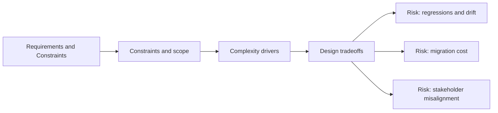

# Requirements and Constraints

@Metadata {
  @PageKind(article)
  @PageColor(gray)
  @TitleHeading("Requirements and Constraints")
  @PageImage(purpose: icon, source: "system-designs-system-design-dimensions-icon.codex", alt: "Requirements and Constraints icon")
  @PageImage(purpose: card, source: "system-designs-system-design-dimensions-card.codex", alt: "Requirements and Constraints card")
}

@Options {
  @AutomaticSeeAlso(disabled)
}

@Image(source: "system-designs-system-design-dimensions-hero.codex", alt: "Requirements and Constraints hero")

Capture the technical and organizational guardrails.

## Include

- Functional requirements.
- Non-functional constraints (latency, cost, offline, accessibility).
- Organizational constraints (teams, timelines, dependencies).

## Diagram: Context Snapshot

@Image(source: "system-designs-system-design-dimensions-dimensions-requirements-and-constraints-context.mermaid", alt: "Context snapshot")

