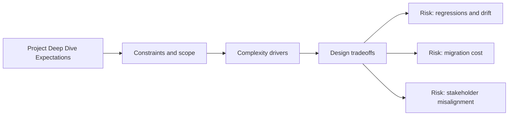

# Project Deep Dive Expectations

@Metadata {
  @PageKind(article)
  @PageColor(gray)
  @TitleHeading("Project Deep Dive Expectations")
  @PageImage(purpose: icon, source: "system-designs-google-maps-font-system-deep-dive-expectations-icon.codex", alt: "Project deep dive expectations Icon")
  @PageImage(purpose: card, source: "system-designs-google-maps-font-system-deep-dive-expectations-card.codex", alt: "Project deep dive expectations Card")
}

@Options {
  @AutomaticSeeAlso(disabled)
}

@Image(source: "system-designs-google-maps-font-system-deep-dive-expectations-hero.codex", alt: "Project deep dive expectations Hero")

## What They Evaluate

They are evaluating senior impact: scope, ownership, complexity, execution,
collaboration, and measurable outcomes. You win by being concrete, quantified,
and decision-driven. This is not a code walkthrough.

## Ten-minute Narrative Template

### 0:00 To 0:45 - Context and Why it Mattered

- Problem, user impact, business risk, scale.
- Mention that the work is within the last year.

### 0:45 To 1:45 - What You Were Solving for and Scope

- Success definition and constraints.
- Explicit non-goals and why they were excluded.

### 1:45 To 3:00 - Ownership Boundaries

- "I owned X end to end" from design to rollout and metrics.
- "I did not own Y, but I influenced it by Z."

### 3:00 To 4:30 - One Visual

- One system diagram: client to services to storage and cache to observability.
- Point out where the hard part lives and where failures are handled.
- Use Search Results as the concrete example for the data flow and layout risks.

### 4:30 To 6:30 - Technical Depth

- Two to three decisions only.
- For each: decision, alternatives, tradeoff, why correct for constraints.
- Include the font caching policy and the surface-level flag strategy.

### 6:30 To 7:30 - Execution and Rollout

- Milestones, feature flags, staged rollout, canary, regression handling.
- Oncall follow-through.
- Mention max Dynamic Type snapshots for Search Results and scroll perf gates.

### 7:30 To 8:30 - Outcomes

- Quantified before and after deltas.
- Tie directly back to the original goal.
- Call out the Search Results deltas (truncation fixes, diff count, perf).

### 8:30 To 9:30 - Collaboration and Mentoring

- Partner teams, QA strategy, coordination mechanisms.
- Mentoring and the resulting leverage.

### 9:30 To 10:00 - Learnings and Next Step

- One technical learning, one process learning.
- A credible next step.

## Common Ways Candidates Lose

- Too much background and not enough "I did X; result was Y."
- Listing technologies without explaining the choices.
- No rollout or validation story.
- No metrics or only vague metrics.

## Transition Mindset

- Coding exercise mindset: ship correctness fast, prove with state and tests,
  polish last.
- Deep dive mindset: tell a decision-and-results story, show ownership and
  impact with numbers.

## Offer to Draft the Script

If you provide a one-paragraph description of your deep dive project
(problem, role, and one outcome metric), we will produce a tight 10-minute
script plus the diagram content you should draw from memory.

## Diagram: Context Snapshot

@Image(source: "system-designs-google-maps-font-system-deep-dive-expectations-context.mermaid", alt: "Context snapshot")

