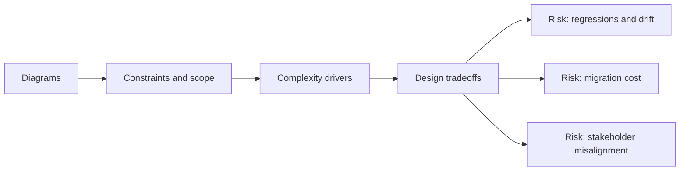

# Diagrams

@Metadata {
  @PageKind(article)
  @PageColor(gray)
  @TitleHeading("Design System Diagrams")
  @PageImage(purpose: icon, source: "system-designs-google-maps-font-system-diagrams-icon.codex", alt: "Diagrams Icon")
  @PageImage(purpose: card, source: "system-designs-google-maps-font-system-diagrams-card.codex", alt: "Diagrams Card")
}

@Options {
  @AutomaticSeeAlso(disabled)
}

@Image(source: "system-designs-google-maps-font-system-diagrams-hero.codex", alt: "Diagrams Hero")

Diagrams now live alongside the narrative sections that explain them. Use this
page as an index and a rendering note, not a gallery.

## Diagram Locations

- Google Maps typography design overview
- Problem context
- Strategy and execution
- Migration details
- Rollout and results
- Search Results example lives in the narrative sections above; no standalone
  diagram required.
- Refactor CLI architecture lives in migration details.

## Source of Truth

Mermaid sources live in `docc/websites/laussat-studio.docc/resources/mermaid/`.
Rendered SVGs live at the bundle root: `docc/websites/laussat-studio.docc/resources/`.

## Diagram: Context Snapshot

@Image(source: "system-designs-google-maps-font-system-diagrams-context.mermaid", alt: "Context snapshot")

## Rendered Exports (Validator Index)

@Image(source: "maps-font-level0.codex", alt: "Google Maps font migration overview")
@Image(source: "maps-font-before-apis.codex", alt: "Before state with five typography APIs")
@Image(source: "maps-font-after-canonical.codex", alt: "After state with canonical tokens and shims")
@Image(source: "maps-font-dependency-map.codex", alt: "Dependency map for shared API first")
@Image(source: "maps-font-decision-tree.codex", alt: "Decision tree for migration strategy")
@Image(source: "maps-font-automation-pipeline.codex", alt: "Automation pipeline")
@Image(source: "maps-font-before-after-di.mermaid", alt: "Before to after typography system")
@Image(source: "maps-font-runtime-flow.codex", alt: "Canonical pipeline runtime flow")
@Image(source: "maps-font-migration-plan.codex", alt: "Migration plan and rollback points")
@Image(source: "maps-font-snapshot-triage.codex", alt: "Snapshot triage loop")
@Image(source: "maps-font-umbrella-before.codex", alt: "Umbrella header coupling before the migration")
@Image(source: "maps-font-umbrella-after.codex", alt: "Compat umbrella during transition")
