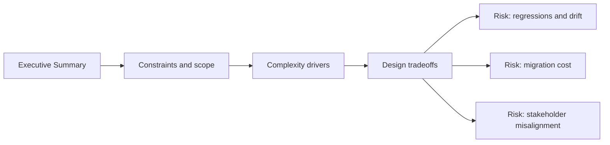

# Executive Summary

@Metadata {
  @PageKind(article)
  @PageColor(gray)
  @TitleHeading("Behavioral Success Story")
  @PageImage(purpose: icon, source: "system-designs-google-maps-font-system-executive-summary-icon.codex", alt: "Executive summary icon")
  @PageImage(purpose: card, source: "system-designs-google-maps-font-system-executive-summary-card.codex", alt: "Executive summary card")
}

@Options {
  @AutomaticSeeAlso(disabled)
}

@Image(source: "system-designs-google-maps-font-system-executive-summary-hero.codex", alt: "Executive summary hero")

## Story

We moved from five competing typography APIs to a single canonical pipeline without breaking
layout, accessibility, or rollout velocity. The real win was behavioral: teams could change
typography with confidence, without fear of hidden import failures or regression storms.

The immediate design mandate was to stop looking like Apple Maps. We needed distinct Google
fonts for action buttons and headline text while keeping Apple fonts for 16-point text and below.

The example we used to validate the system design was the Search Results row: a title, subtitle,
and distance badge that previously drifted across teams and release trains.

## Outcomes

- Consolidated typography entry points into a single registry.
- Reduced visual drift across UIKit and SwiftUI.
- Enabled staged rollouts with fast rollback controls.
- Reduced the style catalog from roughly 15 styles to about 10.
- Migrated a high-risk surface (Search Results) with no regressions at max Dynamic Type.

## Why it Worked

- We separated typography migration from import‑hygiene migration.
- We preserved legacy call sites with compatibility shims.
- We phased migration through shared components before feature surfaces.

## Diagram: Context Snapshot

@Image(source: "system-designs-google-maps-font-system-executive-summary-context.mermaid", alt: "Context snapshot")

## Start State

@TabNavigator {
  @Tab("Animated") {
    @Image(source: "system-designs-google-maps-font-system-typography-stack-start", alt: "Typography stack before migration (animated)")
  }
  @Tab("Exploded") {
    @Image(source: "system-designs-google-maps-font-system-typography-stack-start-exploded", alt: "Typography stack before migration (exploded)")
  }
}

## Final State

@TabNavigator {
  @Tab("Animated") {
    @Image(source: "svg-google-maps-fonts-terra-stack-animated", alt: "Google Maps typography stack from front to isometric")
  }
  @Tab("Exploded") {
    @Image(source: "svg-google-maps-fonts-terra-stack-exploded", alt: "Google Maps typography stack exploded")
  }
}
