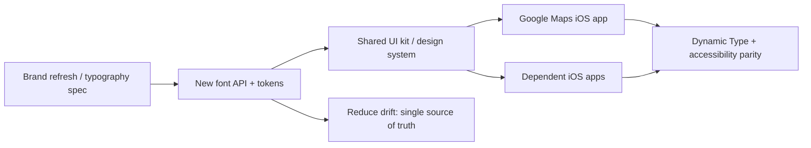
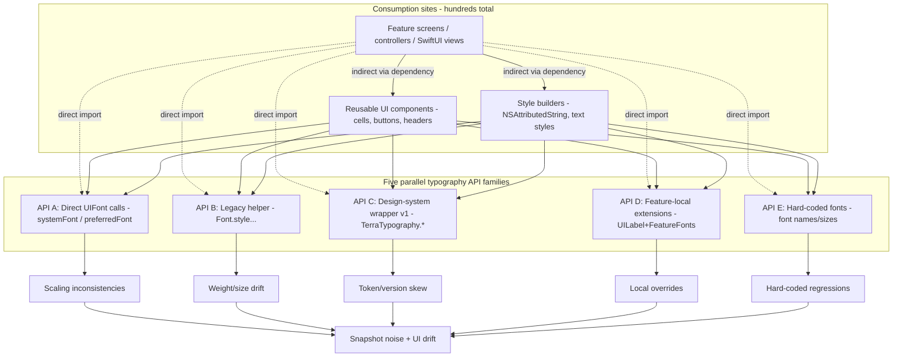
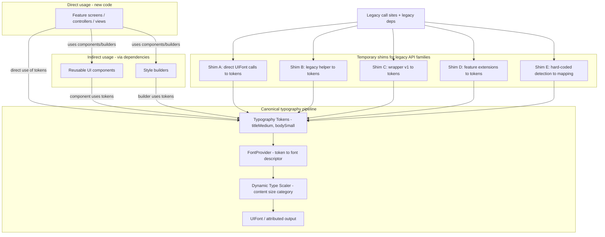

# Google Maps Typography Design Overview

@Metadata {
  @PageKind(article)
  @PageColor(gray)
  @TitleHeading("Google Maps Typography Design Overview")
  @PageImage(purpose: icon, source: "system-designs-google-maps-font-system-google-maps-typography-design-overview-icon.codex", alt: "Google Maps typography design overview icon")
  @PageImage(purpose: card, source: "system-designs-google-maps-font-system-google-maps-typography-design-overview-card.codex", alt: "Google Maps typography design overview card")
}

@Options {
  @AutomaticSeeAlso(disabled)
}

@Image(source: "system-designs-google-maps-font-system-google-maps-typography-design-overview-hero.codex", alt: "Google Maps typography design overview hero")

A case study on building a typography system for Google Maps iOS: how we moved
from fragmented font APIs to a canonical pipeline without breaking layout,
accessibility, or performance at massive scale.

This case study follows the <doc:system-design-dimensions> template.

## Reference Example

This case study uses the Search Results row as the reference surface for the
system design: title, subtitle, and distance badge mapped to canonical tokens,
validated at max Dynamic Type, and gated behind a surface-level rollout flag.

## Template Coverage

This case study covers the following dimensions:

Executive Summary, Problem Context, Goals and Non-goals, Requirements and
Constraints, Stakeholders and Ownership, Architecture Overview, Data Flows and
Interfaces, Risks and Tradeoffs, Security, Privacy, Compliance, Reliability,
Scalability, Performance, Observability and Operations, Testing and Validation,
Migration and Rollout, Results and Metrics, and Lessons and Next Steps.

Optional dimensions if we expand later:

Appendix and References.

## Problem Statement

Large iOS apps often hard-code fonts in dozens of UI layers. Changing a font
family can trigger layout regressions, accessibility issues, and inconsistent
visual output.

The change was also a brand clarity issue: users struggled to distinguish
Google Maps from Apple Maps without a distinct typography signature.

## Context

Google Maps shipped across hundreds of screens, each with its own local
typography practices. Multiple font APIs accumulated over years, and a shared
design system umbrella import pulled in typography along with unrelated
subsystems. Any change to typography risked breaking both UI layout and
import stability.

## Role and Scope

- **Scope:** iOS typography system and migration strategy.
- **Focus:** Build a canonical font pipeline and staged migration plan.
- **Constraints:** Avoid large-scale churn and keep rollouts reversible.

## Goals

- Provide a single source of truth for typography across the app.
- Support fast rollouts and safe rollbacks.
- Preserve Dynamic Type and accessibility behavior.
- Keep rendering performance stable.

## Non-goals

- Rewriting every UI to a new architecture.
- Removing all legacy UIKit or SwiftUI typography usage.

## Architecture Overview

- **Font registry:** A centralized registry that maps semantic roles to concrete
  font descriptors.
- **Theme adapters:** UIKit and SwiftUI adapters that read from the registry and
  apply font scaling rules.
- **Migration layer:** Compatibility helpers that bridge legacy font calls into
  the new system.
- **Release controls:** A feature flag or configuration toggle to roll out fonts
  safely.
- **Telemetry hooks:** Snapshot diff signals, runtime warnings, and performance
  counters for layout and text rendering.

@Image(source: "maps-font-level0.mermaid", alt: "Google Maps font migration overview")

## Execution Strategy

- Establish a canonical font registry and token contract.
- Add shims so legacy APIs flow through the new pipeline.
- Separate typography migration from import-hygiene migration to avoid
  unbounded churn.
- Roll out by shared components first, then feature call sites.

## Before State (What Made This Hard)

@Image(source: "maps-font-before-apis.mermaid", alt: "Before state with five typography APIs")

- **Five parallel font API families** spread across hundreds of references.
- **Import side effects:** The typography API was also an import gateway. It
  served as an umbrella header/module for the entire design system.
- **Transitive import coupling:** Removing the typography APIs to fix font
  drift was a structural change that severed transitive imports. Subsystems
  like colors, spacing, icons, metrics, and macros would disappear from the
  compile path.
- **Maps-scale churn:** Deleting the umbrella immediately would trigger failures
  in unrelated code, exploding the churn and review risk.

## Canonical Pipeline (After State)

@Image(source: "maps-font-after-canonical.mermaid", alt: "After state with canonical tokens and shims")

## Migration Implications

- **Decoupling concerns:** The migration had to separate the canonical
  typography pipeline from the import-stability concern.
- **Compatibility facade:** An intentionally-managed compatibility facade was
  required to preserve build stability. This allowed the umbrella to be retired
  on a controlled schedule rather than the compiler's schedule.
- **Parallel migrations:** This effectively created two parallel tracks:
  1. **Typography migration:** Five font entry points to tokens/provider/scaling.
  2. **Import hygiene migration:** Transitive umbrella imports to explicit imports.
- **Operational strategy:** The best order at scale was to migrate shared
  components first (the largest source of indirect imports), then migrate
  feature call sites to collapse the transitive surface area fastest.

## Data Model

- **Semantic roles:** `display`, `title`, `body`, `caption`, `code`.
- **Variants:** `regular`, `medium`, `semibold`, `bold`.
- **Dynamic Type sizes:** Mapped through `UIFontMetrics` or SwiftUI
  `Font` scaling.
- **Locale rules:** Per-locale font fallback chain for missing glyphs.
- **Brand channel:** Stable keys for A/B fonts without forcing API changes.
- **API surface:** Headline (`s`, `m`, `l`), body (`s`, `m`, `l`), text (`s`, `m`).

## Flow

1. Product and design define semantic roles for screens and components.
2. Registry maps each role to a concrete font family + weight.
3. UIKit/SwiftUI adapters resolve fonts at render time.
4. Metrics instrumentation tracks layout and performance changes.
5. Rollout proceeds via staged flag and measurement gates.

## System Design Aspects

- **Single source of truth:** Tokens live in a shared module consumed by app and
  UI kit. Changes are versioned and reviewed like API changes.
- **Caching policy:** Fonts are cached at the descriptor level to avoid repeated
  weight/size work on scroll-heavy views.
- **Feature flags:** One global flag gates the new mapping plus a per-surface
  override for high-risk screens.
- **Failure modes:** Missing font file falls back to system font and emits a
  runtime diagnostic event.
- **Operational guardrails:** Snapshot diffs at all Dynamic Type sizes gate
  promotion to the next rollout tier.

## Observability

- Crash-free sessions and layout regression reports.
- Dynamic Type visual diffs across supported sizes.
- Performance metrics for text rendering and layout passes.
- Token adoption coverage by module and surface.
- Rollback rate and error spikes tied to font load failures.

## Rollout Strategy

Begin with internal builds and TestFlight cohorts. Gate rollout by OS version
and device class. Maintain a rollback toggle to revert the font mapping quickly.

## Example: Search Results Row

**Context:** A search results list cell renders a title, subtitle, and distance
badge. Before the migration, each element picked a font locally and drifted
across releases.

**Token mapping:**

- Title: `titleMedium.semibold`
- Subtitle: `bodySmall.regular`
- Distance badge: `caption.regular`

**Render path:**

1. Cell requests tokens from the registry.
2. Registry resolves to the brand family and weight.
3. Adapter applies Dynamic Type scaling.
4. Cached descriptor returns on subsequent rows.

**Migration path:**

- Legacy calls routed through shim D (feature extensions) to tokens.
- Feature flag enables the new mapping for the search surface only.
- Snapshot tests compare small/large Dynamic Type sizes before rollout.

**Success criteria:**

- No truncation regressions on SE and Plus screen classes.
- No increase in text layout time on fast scroll benchmarks.
- Type 2 experimentation rollout at 1, 5, 10, 50, 100.

## Risks and Mitigations

**Risk:** Layout overflow in tight UI components. **Mitigation:** Targeted UI
snapshots with max Dynamic Type size.

**Risk:** Custom font fallback if font file missing. **Mitigation:** Bundle
verification in CI and runtime fallback logging.

**Risk:** Performance regression in text-heavy screens. **Mitigation:** Cache
font descriptors and profile layout passes.

## Outcomes

Centralized typography control with safer rollouts. Reduced visual drift across
UIKit and SwiftUI. A migration playbook that scaled across the product surface.

## Topics

- <doc:executive-summary>
- <doc:problem-context>
- <doc:requirements-and-constraints>
- <doc:stakeholders-and-ownership>
- <doc:strategy-and-execution>
- <doc:rollout-and-results>
- <doc:lessons>
- <doc:migration-details>
- <doc:deep-dive-expectations>
- <doc:open-questions>
- <doc:scaling-challenges>
