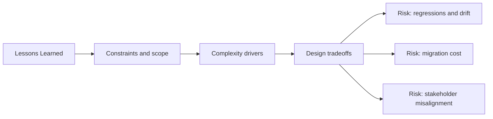

# Lessons Learned

@Metadata {
  @PageKind(article)
  @PageColor(gray)
  @TitleHeading("Lessons Learned")
  @PageImage(purpose: icon, source: "system-designs-google-maps-font-system-lessons-icon.codex", alt: "Lessons icon")
  @PageImage(purpose: card, source: "system-designs-google-maps-font-system-lessons-card.codex", alt: "Lessons card")
}

@Options {
  @AutomaticSeeAlso(disabled)
}

@Image(source: "system-designs-google-maps-font-system-lessons-hero.codex", alt: "Lessons hero")

## What Stuck

- Decouple migration tracks so teams can ship safely.
- Preserve legacy APIs while the new system proves itself.
- Move shared components first to reduce blast radius.
- Treat one high-traffic surface (Search Results) as the reference example.
- Contrast: the color upgrade had no design token usage, so changes were manual.

## What We Would Do Again

- Invest in observability from day one.
- Make rollback a first‑class capability.
- Tie typography changes to measurable outcomes.
- Require max Dynamic Type snapshots for the example surface before rollout.

## Next Steps

- Finish removing legacy shims once migration completes.
- Publish a migration playbook for future design system changes.
- Extend tokens to cover new typography use cases without adding new APIs.
- Document the Search Results example as a reusable template for future rollouts.

## Diagram: Context Snapshot

@Image(source: "system-designs-google-maps-font-system-lessons-context.mermaid", alt: "Context snapshot")

