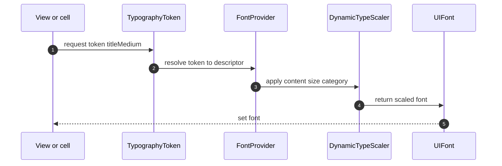
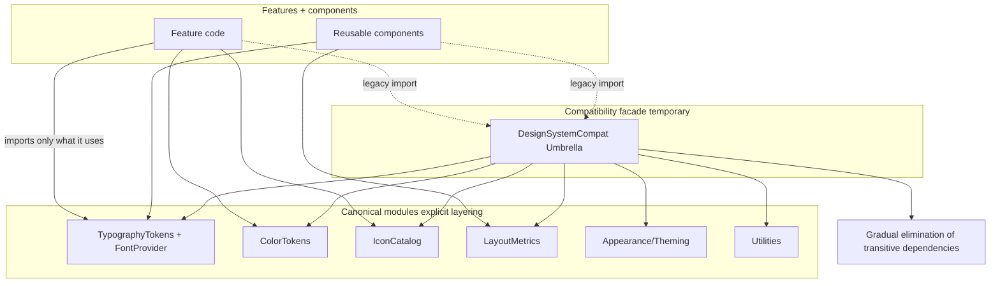
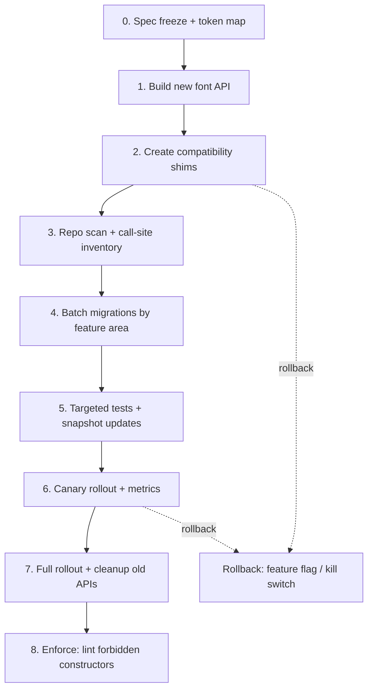
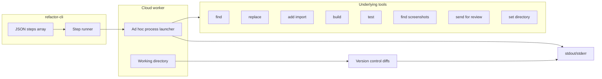

# Font Migration Details

@Metadata {
  @PageKind(article)
  @PageColor(gray)
  @TitleHeading("Font Migration Details")
  @PageImage(purpose: icon, source: "system-designs-google-maps-font-system-migration-details-icon.codex", alt: "Font migration details Icon")
  @PageImage(purpose: card, source: "system-designs-google-maps-font-system-migration-details-card.codex", alt: "Font migration details Card")
}

@Options {
  @AutomaticSeeAlso(disabled)
}


@Image(source: "system-designs-google-maps-font-system-migration-details-hero.codex", alt: "Font migration details Hero")

## Context

The font migration replaced a fragmented typography surface with a canonical
pipeline that was safe to roll out in a large iOS app ecosystem.

## Before State

- Five parallel font API families were in use across hundreds of references.
- Usage was direct and indirect, so many call sites depended on typography APIs
  through shared components and style builders.
- One API family lived behind a design system umbrella header, which also
  re-exported non-typography subsystems.
- Removing that umbrella to fix typography broke unrelated compile paths for
  colors, spacing, icons, metrics, macros, and utilities.
- Example calls included:
  - `UIFont fontWith`
  - `AZFontWithStyle(enum1)`
  - `MDCFont.font1`
  - `MDC2Font.font4` (reversed to match `font1` over time)

## Target State

- One canonical pipeline: tokens to provider to scaled font output.
- Legacy entry points routed through shims that mapped into tokens.
- Explicit imports replaced umbrella-based transitive dependencies.
- An intermediate cache sat between token resolution and UIFont creation.
- Cache keys used font family + size; eviction triggered on memory warnings.
- New API entry points exposed:
  - `fontFamilySmall`
  - `fontFamilyMedium`
  - `fontFamilyLarge`

## Diagram: Runtime Font Resolution

@Image(source: "maps-font-runtime-flow.mermaid", alt: "Canonical pipeline runtime flow")



## Diagram: Compat Umbrella During Transition

@Image(source: "maps-font-umbrella-after.mermaid", alt: "Compat umbrella during transition")



## Migration Strategy

1. Freeze the typography spec and build a token map.
2. Implement a new font API and a compatibility layer for legacy calls.
3. Scan the repo to inventory direct and indirect call sites.
4. Batch migrations by feature area to keep PRs reviewable.
5. Run targeted tests and snapshot updates per batch.
6. Roll out in canary stages with metrics gates.
7. Retire legacy APIs and enforce lint rules against old constructors.

## Batch Prioritization Recipe

Migrations were prioritized by repeatable automation recipes that the refactor
tool could run end-to-end:

1. Find API call sites.
2. Replace imports.
3. Replace API usage with tokens.
4. Lint.
5. Build.
6. Test.
7. Update snapshots or baselines when expected.
8. Send for review.

## Example Migration: Search Results Row

1. Map title/subtitle/badge styles to tokens (`titleMedium`, `bodySmall`,
   `caption`).
2. Route legacy helper calls through shim D to the token registry.
3. Enable the new mapping behind a surface flag for Search Results.
4. Run max Dynamic Type snapshots and scroll perf benchmarks.
5. Promote after two green cohorts; keep rollback to legacy helpers.

## Diagram: Migration Plan

@Image(source: "maps-font-migration-plan.mermaid", alt: "Migration plan and rollback points")



## Automation Pipeline

- Scan the codebase to locate font call sites.
- Cluster results by module and owner.
- Generate PR-sized batches and apply transformations.
- Run targeted tests and snapshot suites.
- Triage diffs, update baselines when expected, and track metrics.

## Refactor CLI Architecture

The `refactor-cli` tool runs on macOS or Linux cloud workers and executes a
JSON array of steps (find, replace, add import, build, test, find screenshots,
send for review, set directory). It launches processes ad hoc and reports
failures directly from stdout/stderr.

@Image(source: "maps-font-automation-cli-architecture.mermaid", alt: "Refactor CLI architecture")



## Before to After: API Sprawl to Dependency Injection

@Image(source: "maps-font-before-after-di.mermaid", alt: "Before to after typography system")

```mermaid
%% file: maps-font-before-after-di.svg
%% title: Before to after - dependency injection + Dynamic Type path
flowchart LR
  subgraph BEFORE[Before: API sprawl]
    B1[UIFont fontWith]
    B2[AZFontWithStyle(enum1)]
    B3[MDCFont.font1]
    B4[MDC2Font.font4]
  end

  subgraph AFTER[After: dependency injection]
    TOK[Typography tokens]
    DI[Injected FontProvider]
    DT[Dynamic Type scaler]
    OUT[UIFont / SwiftUI Font]
    TOK --> DI --> DT --> OUT
  end

  subgraph REV[Reviewer actions]
    G[Linked guides]
    SH[Generated screenshots]
  end

  BEFORE -->|shim + mapping| TOK
  OUT --> SH
  G --> SH
```

## Contrast: Color Upgrade

The earlier color upgrade had no design token usage. All changes were manual
and applied directly by developers.

## Snapshot Triage Loop

- If a diff is expected, update baselines and record the reason.
- If a diff is a regression, fix the mapping or layout constraint.
- If a diff is noise, refine the test or filtering rule.

## Rollout Controls

- Feature flags to enable quick rollback.
- Canary cohorts by OS version and device class.
- Monitoring for crash-free rate, layout regressions, and performance.
- Type 2 experimentation cohorts: 1, 5, 10, 50, 100.

## Testing and Validation

- Snapshot suites for key screens at multiple Dynamic Type sizes.
- Targeted UI tests for text-heavy flows and critical layouts.
- Static analysis to block legacy API usage during the migration.
- Runtime logging for fallback fonts and missing token mappings.
- Snapshot baselines were generated in the cloud. We ran test targets, reviewed
  failures, then migrated old snapshot tests to the new baselines.
- The automated snapshot tool failed on Linux when the command length exceeded
  the character limit, so batches were split to keep commands shorter.

## Risks and Tradeoffs

- **Tradeoff:** Temporary shim layer increases surface area.
  **Benefit:** Safe migration without breaking call sites.
- **Tradeoff:** Duplicate APIs during transition.
  **Benefit:** Teams can migrate on their own schedule.

## Decision Rationale

- A big-bang migration was rejected due to risk and review overhead.
- An incremental shim-based approach limited blast radius and enabled
  multi-app adoption.
- Shared components were migrated first to collapse indirect usage quickly.
