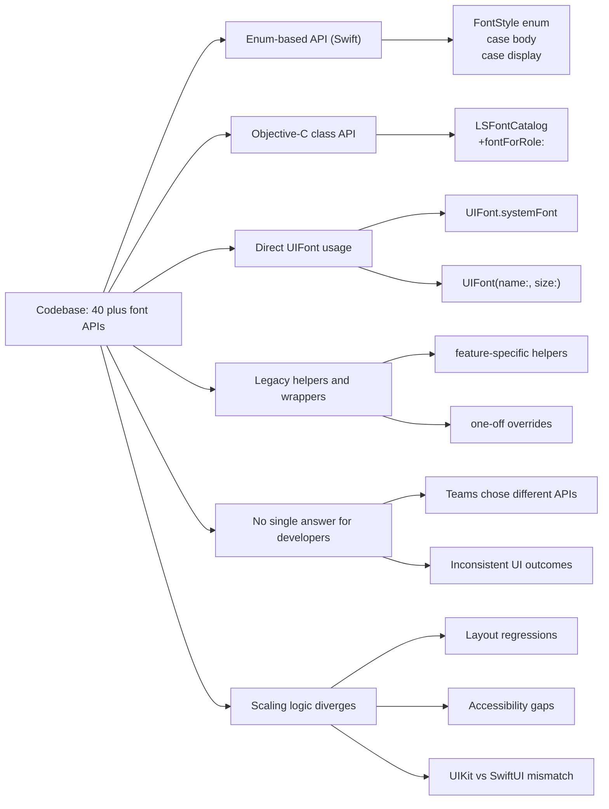
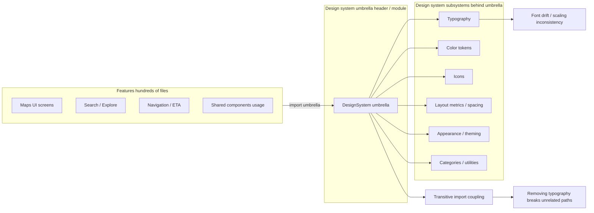

# Problem and Context

@Metadata {
  @PageKind(article)
  @PageColor(gray)
  @TitleHeading("Why Typography Drifted")
  @PageImage(purpose: icon, source: "system-designs-google-maps-font-system-problem-context-icon.codex", alt: "Problem context icon")
  @PageImage(purpose: card, source: "system-designs-google-maps-font-system-problem-context-card.codex", alt: "Problem context card")
}

@Options {
  @AutomaticSeeAlso(disabled)
}

@Image(source: "system-designs-google-maps-font-system-problem-context-hero.codex", alt: "Problem context hero")

## Context

Google Maps shipped across hundreds of screens with multiple font APIs, each owned by different
teams over time. Typography changes triggered layout regressions, accessibility gaps, and
inconsistent rendering between UIKit and SwiftUI.

In the MD1 era, Roboto was deprecated and removed, while MD3 introduced Google Sans as the
replacement type system.

Headlines shifted to Medium weight instead of larger sizes, with Bold reserved as an Ads-only
exception.

Search Results was the canary: titles, subtitles, and distance badges were defined in three
different font helpers, creating visible drift and unpredictable truncation.

## Requirements and Constraints

- Support Dynamic Type and accessibility parity across every surface.
- Keep font rendering performance within existing layout budgets.
- Avoid breaking import graphs during the migration.
- Keep rollouts reversible with a fast kill switch.
- Limit churn so teams can keep shipping in parallel.

## Root Causes

- Five parallel font API families.
- Umbrella imports that coupled typography with unrelated design system modules.
- Inconsistent scaling logic across screens and components.
- No shared cache for font descriptors, causing repeated work in scroll-heavy views.

## Diagram: API Sprawl (Before State)

@Image(source: "maps-font-before-apis-40plus.mermaid", alt: "Before state with 40 plus font APIs")

## Stakeholders and Ownership

- **Design systems:** defined typography tokens and semantic roles.
- **Maps iOS platform:** built the canonical pipeline and shims.
- **Feature teams:** migrated call sites and validated layout behavior.
- **Quality and release:** monitored rollouts and triaged regressions.

## Diagram: Umbrella Coupling

@Image(source: "maps-font-umbrella-before.mermaid", alt: "Umbrella header coupling before the migration")

