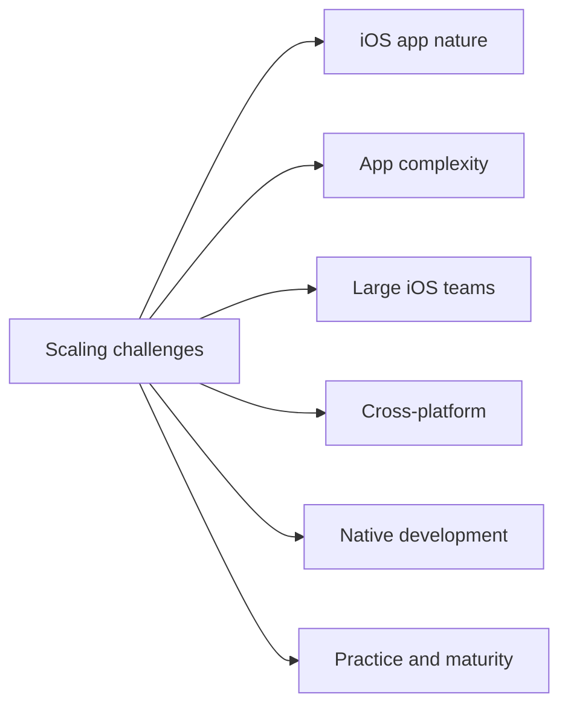

# Scaling Challenges Coverage

@Metadata {
  @PageKind(article)
  @PageColor(gray)
  @PageImage(purpose: icon, source: "ios-scaling-challenges-icon.codex", alt: "Scaling challenges coverage icon")
  @PageImage(purpose: card, source: "ios-scaling-challenges-card.codex", alt: "Scaling challenges coverage card")
}

@Image(source: "ios-scaling-challenges-hero.codex", alt: "Scaling challenges coverage hero")

A coverage map for how the Google Maps typography system addressed each scaling challenge.

## Diagram: Coverage Map

@Image(source: "system-designs-google-maps-font-system-scaling-challenges-context.mermaid", alt: "Coverage map")

## See Also

### Nature of iOS Apps

- <doc:challenge.ios-app-nature.state-management>
- <doc:challenge.ios-app-nature.mistakes-are-hard-to-revert>
- <doc:challenge.ios-app-nature.long-tail-of-old-app-versions>
- <doc:challenge.ios-app-nature.deeplinks-and-routing>
- <doc:challenge.ios-app-nature.push-and-background-notifications>
- <doc:challenge.ios-app-nature.app-crashes>
- <doc:challenge.ios-app-nature.offline-support>
- <doc:challenge.ios-app-nature.accessibility>
- <doc:challenge.ios-app-nature.ci-cd-and-the-build-train>
- <doc:challenge.ios-app-nature.third-party-libraries-and-sdks>

### App Complexity

- <doc:challenge.app-complexity.device-and-os-fragmentation>
- <doc:challenge.app-complexity.in-app-purchases>
- <doc:challenge.app-complexity.navigation-architecture>
- <doc:challenge.app-complexity.application-state-and-event-driven-changes>
- <doc:challenge.app-complexity.localization>
- <doc:challenge.app-complexity.modular-architecture-and-dependency-injection>
- <doc:challenge.app-complexity.automated-testing>
- <doc:challenge.app-complexity.manual-testing>

### Large iOS Teams

- <doc:challenge.large-ios-teams.planning-and-decision-making>
- <doc:challenge.large-ios-teams.architecting-to-avoid-collisions>
- <doc:challenge.large-ios-teams.shared-architecture-across-ios-apps>
- <doc:challenge.large-ios-teams.tooling-maturity-for-large-ios-teams>
- <doc:challenge.large-ios-teams.scaling-build-and-merge-times>
- <doc:challenge.large-ios-teams.mobile-platform-libraries-and-teams>

### Native vs Cross-platform

- <doc:challenge.cross-platform.cross-platform-feature-development>
- <doc:challenge.cross-platform.web-pwa-and-server-driven-apps>

### Native Development

- <doc:challenge.native-development.adopting-new-languages-and-frameworks>
- <doc:challenge.native-development.interop-and-shared-logic-boundaries>
- <doc:challenge.native-development.cross-platform-vs-native-decision-framework>

### Practice and Maturity

- <doc:challenge.practice-and-maturity.experimentation>
- <doc:challenge.practice-and-maturity.feature-flag-hell>
- <doc:challenge.practice-and-maturity.performance>
- <doc:challenge.practice-and-maturity.analytics-monitoring-and-alerting>
- <doc:challenge.practice-and-maturity.mobile-oncall>
- <doc:challenge.practice-and-maturity.advanced-code-quality-checks>
- <doc:challenge.practice-and-maturity.compliance-privacy-and-security>
- <doc:challenge.practice-and-maturity.client-side-data-migrations>
- <doc:challenge.practice-and-maturity.forced-upgrading>
- <doc:challenge.practice-and-maturity.app-size>

