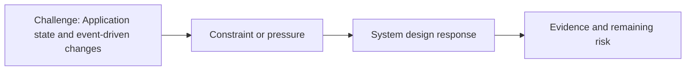

# Application State and Event-driven Changes

@Metadata {
  @PageKind(article)
  @PageColor(gray)
  @PageImage(purpose: icon, source: "ios-scaling-challenges-14-application-state-and-event-driven-changes-icon.codex", alt: "Application state and event-driven changes icon")
  @PageImage(purpose: card, source: "ios-scaling-challenges-14-application-state-and-event-driven-changes-card.codex", alt: "Application state and event-driven changes card")
}

@Image(source: "ios-scaling-challenges-14-application-state-and-event-driven-changes-hero.codex", alt: "Application state and event-driven changes hero")

This page records how the Google Maps typography system addressed "Application state and event-driven changes".

## Challenge

Dynamic font is still not possible. This remains a known limitation.

## System Design Response

## Evidence and Remaining Risk

Remaining risk: test harnesses would need 5x screenshots, which is not viable
with 100k screenshots.
## Diagram: Context Snapshot

@Image(source: "system-designs-google-maps-font-system-scaling-challenges-challenge.app-complexity.application-state-and-event-driven-changes-context.mermaid", alt: "Context snapshot")

