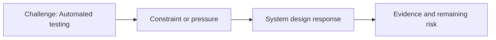

# Automated Testing

@Metadata {
  @PageKind(article)
  @PageColor(gray)
  @PageImage(purpose: icon, source: "ios-scaling-challenges-17-automated-testing-icon.codex", alt: "Automated testing icon")
  @PageImage(purpose: card, source: "ios-scaling-challenges-17-automated-testing-card.codex", alt: "Automated testing card")
}

@Image(source: "ios-scaling-challenges-17-automated-testing-hero.codex", alt: "Automated testing hero")

This page records how the Google Maps typography system addressed "Automated testing".

## Challenge

Automated screenshot tooling could not keep up with the scope of typography
changes. The auto-upgrade pipeline broke because screenshots could only be
generated on Linux, and the existing split/automation tools assumed changes
stayed within known logical boundaries (for example, a single library). A
fundamental design primitive touched everything, so that assumption failed.

## System Design Response

We hand-processed JSONL bundles that carried the dynamic locations of
screenshots to migrate. A custom workflow would:

- find the test output on the build server,
- decode the JSONL bundle,
- copy the screenshots into the correct cloud version-control environment.

## Evidence and Remaining Risk

Remaining risk: long-running test runners remained a bottleneck even after the
manual migration workflow.
## Diagram: Context Snapshot

@Image(source: "system-designs-google-maps-font-system-scaling-challenges-challenge.app-complexity.automated-testing-context.mermaid", alt: "Context snapshot")

