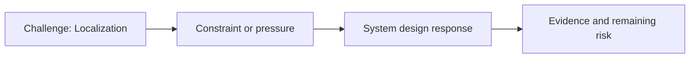

# Localization

@Metadata {
  @PageKind(article)
  @PageColor(gray)
  @PageImage(purpose: icon, source: "ios-scaling-challenges-15-localization-icon.codex", alt: "Localization icon")
  @PageImage(purpose: card, source: "ios-scaling-challenges-15-localization-card.codex", alt: "Localization card")
}

@Image(source: "ios-scaling-challenges-15-localization-hero.codex", alt: "Localization hero")

This page records how the Google Maps typography system addressed "Localization".

## Challenge

Google Fonts introduced taller ascenders and descenders than the default Apple
typefaces. That created localization risk: glyph height varies across scripts,
and layouts tuned for SF could clip or regress once the new fonts landed.

Han unification was a concern, but the rollout scope was limited to Hong Kong.

## System Design Response

Key labels disabled `clipToBounds` to accommodate Google Sans ascenders on iOS.
That avoided truncation without reworking every baseline or line-height rule.

## Evidence and Remaining Risk

Remaining risk: even if the rollout focused on Hong Kong, Chinese users can
travel abroad, so localization exposure extends beyond a single region.

Vietnamese localization remains especially difficult. Future work: use new
locale-aware labels.
## Diagram: Context Snapshot

@Image(source: "system-designs-google-maps-font-system-scaling-challenges-challenge.app-complexity.localization-context.mermaid", alt: "Context snapshot")

