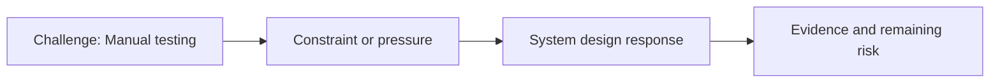

# Manual Testing

@Metadata {
  @PageKind(article)
  @PageColor(gray)
  @PageImage(purpose: icon, source: "ios-scaling-challenges-18-manual-testing-icon.codex", alt: "Manual testing icon")
  @PageImage(purpose: card, source: "ios-scaling-challenges-18-manual-testing-card.codex", alt: "Manual testing card")
}

@Image(source: "ios-scaling-challenges-18-manual-testing-hero.codex", alt: "Manual testing hero")

This page records how the Google Maps typography system addressed "Manual testing".

## Challenge

Manual testing depended on the QA team and feedback loops from Manila. The
process was not centered on snapshot or screenshot testing.

## System Design Response

We prioritized early manual testing to catch regressions before automation
could.

## Evidence and Remaining Risk

We created test scripts for known edge languages to cover a sizeable percentage
of languages.
## Diagram: Context Snapshot

@Image(source: "system-designs-google-maps-font-system-scaling-challenges-challenge.app-complexity.manual-testing-context.mermaid", alt: "Context snapshot")

