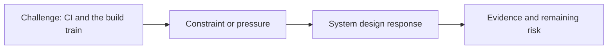

# CI and the Build Train

@Metadata {
  @PageKind(article)
  @PageColor(gray)
  @PageImage(purpose: icon, source: "ios-scaling-challenges-09-ci-cd-and-the-build-train-icon.codex", alt: "CI and the build train icon")
  @PageImage(purpose: card, source: "ios-scaling-challenges-09-ci-cd-and-the-build-train-card.codex", alt: "CI and the build train card")
}

@Image(source: "ios-scaling-challenges-09-ci-cd-and-the-build-train-hero.codex", alt: "CI and the build train hero")

This page records how the Google Maps typography system addressed "CI and the build train".

## Challenge

We needed a custom tool: a CLI refactor to manually retrieve outputs and move
them over the build pipeline.

## System Design Response

We built the custom CLI to manually retrieve outputs and move them over.

## Evidence and Remaining Risk

Remaining risk: the next level would require 5x scale in the pipeline.
## Diagram: Context Snapshot

@Image(source: "system-designs-google-maps-font-system-scaling-challenges-challenge.ios-app-nature.ci-cd-and-the-build-train-context.mermaid", alt: "Context snapshot")

