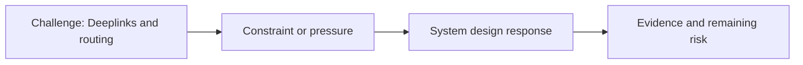

# Deeplinks and Routing

@Metadata {
  @PageKind(article)
  @PageColor(gray)
  @PageImage(purpose: icon, source: "ios-scaling-challenges-04-deeplinks-and-routing-icon.codex", alt: "Deeplinks and routing icon")
  @PageImage(purpose: card, source: "ios-scaling-challenges-04-deeplinks-and-routing-card.codex", alt: "Deeplinks and routing card")
}

@Image(source: "ios-scaling-challenges-04-deeplinks-and-routing-hero.codex", alt: "Deeplinks and routing hero")

This page records how the Google Maps typography system addressed "Deeplinks and routing".

## Challenge

Deep links and routing required state to be set before navigation. We could not
use a global variable; state had to be established by a low-level service
setup before routing occurred.

## System Design Response

The service-level agreement let us run close to the beginning of the app
lifecycle.

## Evidence and Remaining Risk

We verified that weird state restoration and rarely used paths did not trigger
incorrect font usage.
## Diagram: Context Snapshot

@Image(source: "system-designs-google-maps-font-system-scaling-challenges-challenge.ios-app-nature.deeplinks-and-routing-context.mermaid", alt: "Context snapshot")

