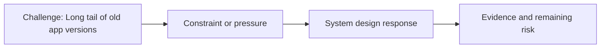

# Long Tail of Old App Versions

@Metadata {
  @PageKind(article)
  @PageColor(gray)
  @PageImage(purpose: icon, source: "ios-scaling-challenges-03-long-tail-of-old-app-versions-icon.codex", alt: "Long tail of old app versions icon")
  @PageImage(purpose: card, source: "ios-scaling-challenges-03-long-tail-of-old-app-versions-card.codex", alt: "Long tail of old app versions card")
}

@Image(source: "ios-scaling-challenges-03-long-tail-of-old-app-versions-hero.codex", alt: "Long tail of old app versions hero")

This page records how the Google Maps typography system addressed "Long tail of old app versions".

## Challenge

All typography APIs needed to remain available across old app versions.

## System Design Response

We ensured that disabling the experiment correctly invalidates caches.

## Evidence and Remaining Risk

We monitored older devices that run slower to make sure nothing was out of
whack.
## Diagram: Context Snapshot

@Image(source: "system-designs-google-maps-font-system-scaling-challenges-challenge.ios-app-nature.long-tail-of-old-app-versions-context.mermaid", alt: "Context snapshot")

