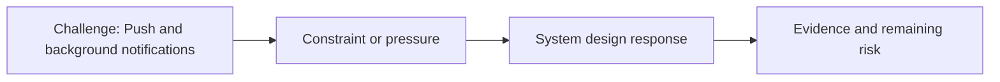

# Push and Background Notifications

@Metadata {
  @PageKind(article)
  @PageColor(gray)
  @PageImage(purpose: icon, source: "ios-scaling-challenges-05-push-and-background-notifications-icon.codex", alt: "Push and background notifications icon")
  @PageImage(purpose: card, source: "ios-scaling-challenges-05-push-and-background-notifications-card.codex", alt: "Push and background notifications card")
}

@Image(source: "ios-scaling-challenges-05-push-and-background-notifications-hero.codex", alt: "Push and background notifications hero")

This page records how the Google Maps typography system addressed "Push and background notifications".

## Challenge

## System Design Response

## Evidence and Remaining Risk

## Diagram: Context Snapshot

@Image(source: "system-designs-google-maps-font-system-scaling-challenges-challenge.ios-app-nature.push-and-background-notifications-context.mermaid", alt: "Context snapshot")

