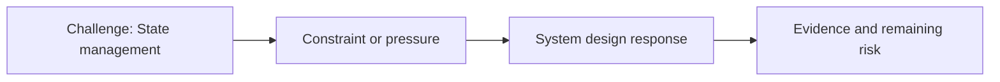

# State Management

@Metadata {
  @PageKind(article)
  @PageColor(gray)
  @PageImage(purpose: icon, source: "ios-scaling-challenges-01-state-management-icon.codex", alt: "State management icon")
  @PageImage(purpose: card, source: "ios-scaling-challenges-01-state-management-card.codex", alt: "State management card")
}

@Image(source: "ios-scaling-challenges-01-state-management-hero.codex", alt: "State management hero")

This page records how the Google Maps typography system addressed "State management".

## Challenge

State management broke down because typography state lived in too many places.
Developers had 40+ APIs (enum, Objective-C class, direct `UIFont` usage) and no
single answer for which entry point to use, so font choices and scaling logic
drifted across screens.

Fonts also could not use the custom color state harness. Typography state
instead relied on dependency injection that reset state per test instance in
concurrent test runs, which only 2 of the 6 test harnesses supported.

## System Design Response

We centralized typography state behind a canonical font loader and provider:

- Canonical entry: `import design-system/typography/fonts.h`, then request the
  exact font through the loader.
- Provider resolves Material 3 tokens, applies Dynamic Type scaling, and
  enforces locale fallback logic.
- Adapters bridge UIKit and SwiftUI so scaling behavior stays consistent.
- Cache key is `font family + font size`, evicted on memory warnings to prevent
  state leaks.
- Experiments can select a branded typography channel without custom branching.
- iPad stayed on legacy typography for ~1 year, so the system preserved a
  controlled split-state path during rollout.

We removed global state and moved into a dependency injection framework. This
was the first adopter of the new build approach, and colors were expected to
follow the same method across the rest of the design system. We treated the
experiment as a chance to level up.

## Evidence and Remaining Risk

Evidence we used to validate the new state model:

- Snapshot suites (100k+ images) across every surface and locale variants.
- Simulator overrides for Asian languages to verify locale fallback behavior.
- Migration sequences that reduced entry points to a small, testable set.

Remaining risks:

- Dynamic Type validation across all screens was deferred to a follow-up.
- Some screens required `clipToBounds = false` for tall ascenders, a layout
  compromise we still track.
## Diagram: Context Snapshot

@Image(source: "system-designs-google-maps-font-system-scaling-challenges-challenge.ios-app-nature.state-management-context.mermaid", alt: "Context snapshot")

