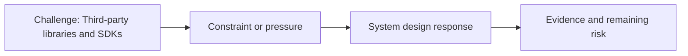

# Third-party Libraries and SDKs

@Metadata {
  @PageKind(article)
  @PageColor(gray)
  @PageImage(purpose: icon, source: "ios-scaling-challenges-10-third-party-libraries-and-sdks-icon.codex", alt: "Third-party libraries and SDKs icon")
  @PageImage(purpose: card, source: "ios-scaling-challenges-10-third-party-libraries-and-sdks-card.codex", alt: "Third-party libraries and SDKs card")
}

@Image(source: "ios-scaling-challenges-10-third-party-libraries-and-sdks-hero.codex", alt: "Third-party libraries and SDKs hero")

This page records how the Google Maps typography system addressed "Third-party libraries and SDKs".

## Challenge

We controlled the font stack directly, so third-party libraries and SDKs did
not add risk to the typography rollout.

## System Design Response

We had no third-party libraries in the font path and guarded against first-party
risks.

## Evidence and Remaining Risk

We tracked crash metrics broken down by Apple OS versions.
## Diagram: Context Snapshot

@Image(source: "system-designs-google-maps-font-system-scaling-challenges-challenge.ios-app-nature.third-party-libraries-and-sdks-context.mermaid", alt: "Context snapshot")

