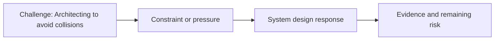

# Architecting to Avoid Collisions

@Metadata {
  @PageKind(article)
  @PageColor(gray)
  @PageImage(purpose: icon, source: "ios-scaling-challenges-20-architecting-to-avoid-collisions-icon.codex", alt: "Architecting to avoid collisions icon")
  @PageImage(purpose: card, source: "ios-scaling-challenges-20-architecting-to-avoid-collisions-card.codex", alt: "Architecting to avoid collisions card")
}

@Image(source: "ios-scaling-challenges-20-architecting-to-avoid-collisions-hero.codex", alt: "Architecting to avoid collisions hero")

This page records how the Google Maps typography system addressed "Architecting to avoid collisions".

## Challenge

For colors, state was passed at the controller level, which required handing
values off between controllers and increased collision risk.

## System Design Response

For fonts, we moved state to a base service level and provided a single API
surface for developers to use.

## Evidence and Remaining Risk

Evidence: all old APIs were wrapped around the new API protocol.
## Diagram: Context Snapshot

@Image(source: "system-designs-google-maps-font-system-scaling-challenges-challenge.large-ios-teams.architecting-to-avoid-collisions-context.mermaid", alt: "Context snapshot")

