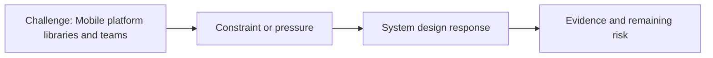

# Mobile Platform Libraries and Teams

@Metadata {
  @PageKind(article)
  @PageColor(gray)
  @PageImage(purpose: icon, source: "ios-scaling-challenges-24-mobile-platform-libraries-and-teams-icon.codex", alt: "Mobile platform libraries and teams icon")
  @PageImage(purpose: card, source: "ios-scaling-challenges-24-mobile-platform-libraries-and-teams-card.codex", alt: "Mobile platform libraries and teams card")
}

@Image(source: "ios-scaling-challenges-24-mobile-platform-libraries-and-teams-hero.codex", alt: "Mobile platform libraries and teams hero")

This page records how the Google Maps typography system addressed "Mobile platform libraries and teams".

## Challenge

We needed to coordinate mobile platform libraries and teams to review typography
changes at scale.

## System Design Response

We branched approvals into specific batches so team members could review
screenshots, created tutorials and documentation for expectations, and drafted
design guidance.

## Evidence and Remaining Risk

Evidence: we added another font category for legal reasons and ad revenue, and
teams were satisfied with the outcome.
## Diagram: Context Snapshot

@Image(source: "system-designs-google-maps-font-system-scaling-challenges-challenge.large-ios-teams.mobile-platform-libraries-and-teams-context.mermaid", alt: "Context snapshot")

