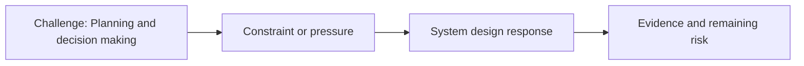

# Planning and Decision Making

@Metadata {
  @PageKind(article)
  @PageColor(gray)
  @PageImage(purpose: icon, source: "ios-scaling-challenges-19-planning-and-decision-making-icon.codex", alt: "Planning and decision making icon")
  @PageImage(purpose: card, source: "ios-scaling-challenges-19-planning-and-decision-making-card.codex", alt: "Planning and decision making card")
}

@Image(source: "ios-scaling-challenges-19-planning-and-decision-making-hero.codex", alt: "Planning and decision making hero")

This page records how the Google Maps typography system addressed "Planning and decision making".

## Challenge

Planning and decision-making were heavily impacted by the scale of change. For
colors, teams previously assigned developers to update ~5k references, but we
could not get buy-in to repeat that for typography.

## System Design Response

We created a CLI refactor tool to perform migrations on a per-API basis. With
40+ APIs, that meant writing 40+ scripts.

## Evidence and Remaining Risk

We negotiated extra time with management due to limited feature developers and
worked on tooling to simplify feature-dev input.
## Diagram: Context Snapshot

@Image(source: "system-designs-google-maps-font-system-scaling-challenges-challenge.large-ios-teams.planning-and-decision-making-context.mermaid", alt: "Context snapshot")

