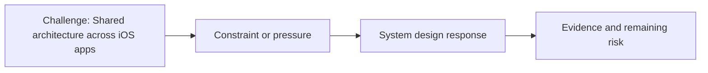

# Shared Architecture Across iOS Apps

@Metadata {
  @PageKind(article)
  @PageColor(gray)
  @PageImage(purpose: icon, source: "ios-scaling-challenges-21-shared-architecture-across-ios-apps-icon.codex", alt: "Shared architecture across iOS apps icon")
  @PageImage(purpose: card, source: "ios-scaling-challenges-21-shared-architecture-across-ios-apps-card.codex", alt: "Shared architecture across iOS apps card")
}

@Image(source: "ios-scaling-challenges-21-shared-architecture-across-ios-apps-hero.codex", alt: "Shared architecture across iOS apps hero")

This page records how the Google Maps typography system addressed "Shared architecture across iOS apps".

## Challenge

Multiple apps used the design system, so each app needed to be configured to
use the new APIs.

## System Design Response

We ensured one API surface for every consumer.

## Evidence and Remaining Risk

Evidence: the right fonts were linked at compile time.
## Diagram: Context Snapshot

@Image(source: "system-designs-google-maps-font-system-scaling-challenges-challenge.large-ios-teams.shared-architecture-across-ios-apps-context.mermaid", alt: "Context snapshot")

