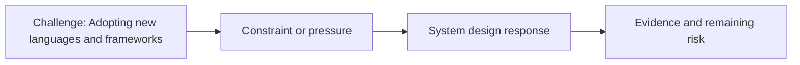

# Adopting New Languages and Frameworks

@Metadata {
  @PageKind(article)
  @PageColor(gray)
  @PageImage(purpose: icon, source: "ios-scaling-challenges-25-adopting-new-languages-and-frameworks-icon.codex", alt: "Adopting new languages and frameworks icon")
  @PageImage(purpose: card, source: "ios-scaling-challenges-25-adopting-new-languages-and-frameworks-card.codex", alt: "Adopting new languages and frameworks card")
}

@Image(source: "ios-scaling-challenges-25-adopting-new-languages-and-frameworks-hero.codex", alt: "Adopting new languages and frameworks hero")

This page records how the Google Maps typography system addressed "Adopting new languages and frameworks".

## Challenge

We needed an API that would adopt cleanly into Swift without relying on C or
enum-based interfaces.

## System Design Response

We used an Objective-C API so Swift could adopt it more easily over time.

## Evidence and Remaining Risk

Evidence: Objective-C let developers use ObjC entry points instead of C
functions.
## Diagram: Context Snapshot

@Image(source: "system-designs-google-maps-font-system-scaling-challenges-challenge.native-development.adopting-new-languages-and-frameworks-context.mermaid", alt: "Context snapshot")

