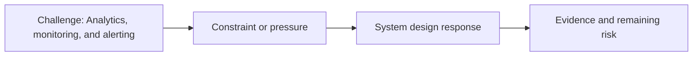

# Analytics, Monitoring, and Alerting

@Metadata {
  @PageKind(article)
  @PageColor(gray)
  @PageImage(purpose: icon, source: "ios-scaling-challenges-33-analytics-monitoring-and-alerting-icon.codex", alt: "Analytics, monitoring, and alerting icon")
  @PageImage(purpose: card, source: "ios-scaling-challenges-33-analytics-monitoring-and-alerting-card.codex", alt: "Analytics, monitoring, and alerting card")
}

@Image(source: "ios-scaling-challenges-33-analytics-monitoring-and-alerting-hero.codex", alt: "Analytics, monitoring, and alerting hero")

This page records how the Google Maps typography system addressed "Analytics, monitoring, and alerting".

## Challenge

We needed post-submit checks to catch regressions that escaped test suites, so
we watched for overnight target failures.

## System Design Response

Mitigation: run global-tap and monitor overnight target failures for missed
cases.

## Evidence and Remaining Risk

Remaining risk: the experiment can be shut down on the next load, so missed
cases may still slip through if monitoring is disabled too early.
## Diagram: Context Snapshot

@Image(source: "system-designs-google-maps-font-system-scaling-challenges-challenge.practice-and-maturity.analytics-monitoring-and-alerting-context.mermaid", alt: "Context snapshot")

