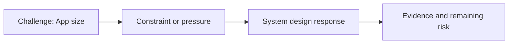

# App Size

@Metadata {
  @PageKind(article)
  @PageColor(gray)
  @PageImage(purpose: icon, source: "ios-scaling-challenges-39-app-size-icon.codex", alt: "App size icon")
  @PageImage(purpose: card, source: "ios-scaling-challenges-39-app-size-card.codex", alt: "App size card")
}

@Image(source: "ios-scaling-challenges-39-app-size-hero.codex", alt: "App size hero")

This page records how the Google Maps typography system addressed "App size".

## Challenge

We had to ensure bundle size would not increase.

## System Design Response

We created a report showing the font was present with and without the feature.

## Evidence and Remaining Risk

Evidence: no app size gain. We created size reports with experimentation
toggled on/off at compile time.
## Diagram: Context Snapshot

@Image(source: "system-designs-google-maps-font-system-scaling-challenges-challenge.practice-and-maturity.app-size-context.mermaid", alt: "Context snapshot")

