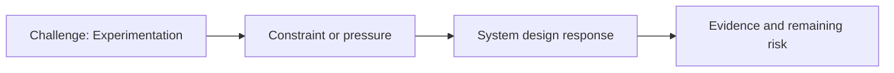

# Experimentation

@Metadata {
  @PageKind(article)
  @PageColor(gray)
  @PageImage(purpose: icon, source: "ios-scaling-challenges-30-experimentation-icon.codex", alt: "Experimentation icon")
  @PageImage(purpose: card, source: "ios-scaling-challenges-30-experimentation-card.codex", alt: "Experimentation card")
}

@Image(source: "ios-scaling-challenges-30-experimentation-hero.codex", alt: "Experimentation hero")

This page records how the Google Maps typography system addressed "Experimentation".

## Challenge

Experimentation needed stronger coverage and clearer control planes for a large
typography change.

## System Design Response

We used four levels of compile-time control and two levels of runtime control.
The new dependency injection system handled experiment settings and this was
the first system to use it.

## Evidence and Remaining Risk

Evidence: startup sequence state is service-based, not global variable-based.
## Diagram: Context Snapshot

@Image(source: "system-designs-google-maps-font-system-scaling-challenges-challenge.practice-and-maturity.experimentation-context.mermaid", alt: "Context snapshot")

