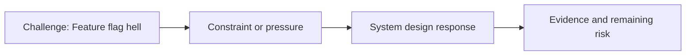

# Feature Flag Hell

@Metadata {
  @PageKind(article)
  @PageColor(gray)
  @PageImage(purpose: icon, source: "ios-scaling-challenges-31-feature-flag-hell-icon.codex", alt: "Feature flag hell icon")
  @PageImage(purpose: card, source: "ios-scaling-challenges-31-feature-flag-hell-card.codex", alt: "Feature flag hell card")
}

@Image(source: "ios-scaling-challenges-31-feature-flag-hell-hero.codex", alt: "Feature flag hell hero")

This page records how the Google Maps typography system addressed "Feature flag hell".

## Challenge

We learned from night mode that feature flags could explode. The new header
style + fonts on iPhone vs the old header + old fonts created a 4x decision
tree for certain design tokens and fonts.

## System Design Response

We lowered experimentation decisions from developer-level switches to internal
tooling decisions.

## Evidence and Remaining Risk

Evidence: developers do not need to worry about experimentation decisions in
the design system.
## Diagram: Context Snapshot

@Image(source: "system-designs-google-maps-font-system-scaling-challenges-challenge.practice-and-maturity.feature-flag-hell-context.mermaid", alt: "Context snapshot")

