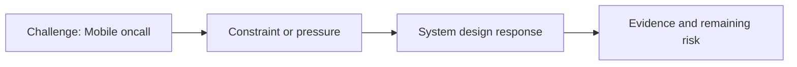

# Mobile Oncall

@Metadata {
  @PageKind(article)
  @PageColor(gray)
  @PageImage(purpose: icon, source: "ios-scaling-challenges-34-mobile-oncall-icon.codex", alt: "Mobile oncall icon")
  @PageImage(purpose: card, source: "ios-scaling-challenges-34-mobile-oncall-card.codex", alt: "Mobile oncall card")
}

@Image(source: "ios-scaling-challenges-34-mobile-oncall-hero.codex", alt: "Mobile oncall hero")

This page records how the Google Maps typography system addressed "Mobile oncall".

## Challenge

Mobile on-call needed a clear escalation path for typography changes.

## System Design Response

We had SRE coverage for on-call support.

## Evidence and Remaining Risk

Evidence: no incidents were reported.

## Diagram: Context Snapshot

@Image(source: "system-designs-google-maps-font-system-scaling-challenges-challenge.practice-and-maturity.mobile-oncall-context.mermaid", alt: "Context snapshot")

