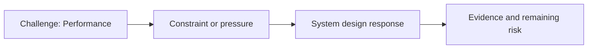

# Performance

@Metadata {
  @PageKind(article)
  @PageColor(gray)
  @PageImage(purpose: icon, source: "ios-scaling-challenges-32-performance-icon.codex", alt: "Performance icon")
  @PageImage(purpose: card, source: "ios-scaling-challenges-32-performance-card.codex", alt: "Performance card")
}

@Image(source: "ios-scaling-challenges-32-performance-hero.codex", alt: "Performance hero")

This page records how the Google Maps typography system addressed "Performance".

## Challenge

All performance metrics had to remain neutral. The first custom font load on
Search made that target difficult to hit.

## System Design Response

We gated the first custom font load behind a long-running experiment to verify
that performance metrics stayed neutral before broad rollout.

## Evidence and Remaining Risk

The rollout did not add new font downloads because Google One already shipped
the font in a small part of the app, reducing network and startup risk.
## Diagram: Context Snapshot

@Image(source: "system-designs-google-maps-font-system-scaling-challenges-challenge.practice-and-maturity.performance-context.mermaid", alt: "Context snapshot")

