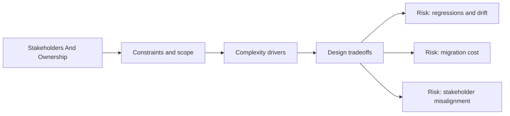

# Stakeholders and Ownership

@Metadata {
  @PageKind(article)
  @PageColor(gray)
  @TitleHeading("Stakeholders And Ownership")
  @PageImage(purpose: icon, source: "system-designs-google-maps-font-system-stakeholders-and-ownership-icon.codex", alt: "system-designs-google-maps-font-system-stakeholders-and-ownership icon")
  @PageImage(purpose: card, source: "system-designs-google-maps-font-system-stakeholders-and-ownership-card.codex", alt: "system-designs-google-maps-font-system-stakeholders-and-ownership card")
}

@Options {
  @AutomaticSeeAlso(disabled)
}

@Image(source: "system-designs-stakeholders-and-ownership-hero.codex", alt: "Stakeholders And Ownership hero")
@Image(source: "system-designs-stakeholders-and-ownership-icon.codex", alt: "Legacy stakeholders icon")
@Image(source: "system-designs-stakeholders-and-ownership-card.codex", alt: "Legacy stakeholders card")
@Image(source: "system-designs-google-maps-font-system-stakeholders-and-ownership-hero.codex", alt: "Stakeholders And Ownership hero")

## Owners

- **Typography tokens:** Terra design team.
- **Implementation:** UIF and Maps iOS team.
- **Migration:** You as the IC.
- **Validation:** QA team.
- **Rollout:** Two-month experimentation window with staged gates.
- **Example surface:** Search Results owners + list UI platform owners.

## Coordination

- Design and engineering aligned on token semantics before migration.
- QA validated staged rollouts across multiple OS and device cohorts.
- Search Results owners approved token mapping and snapshot baselines.

## Diagram: Context Snapshot

@Image(source: "system-designs-google-maps-font-system-stakeholders-and-ownership-context.mermaid", alt: "Context snapshot")

