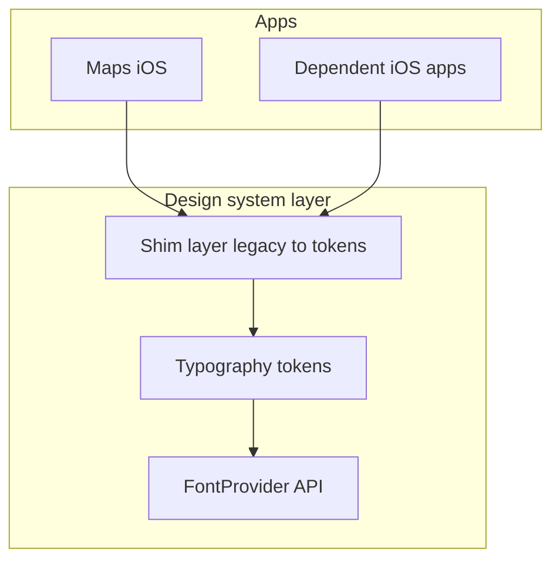
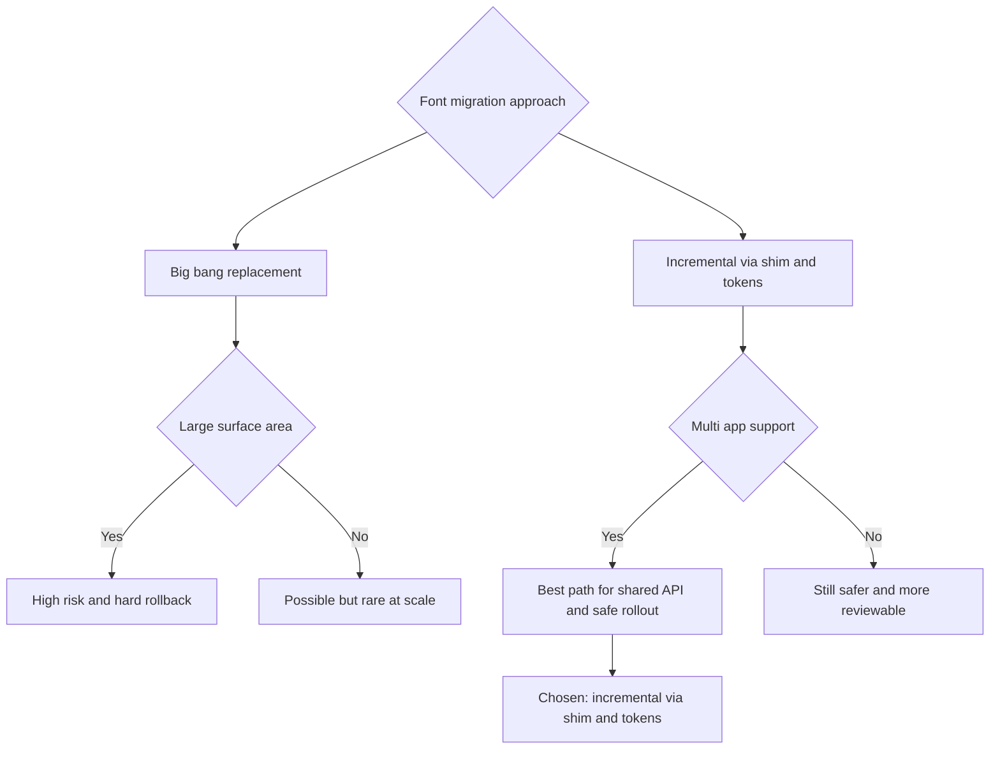

# Strategy and Execution

@Metadata {
  @PageKind(article)
  @PageColor(gray)
  @TitleHeading("Migration Strategy")
  @PageImage(purpose: icon, source: "system-designs-google-maps-font-system-strategy-and-execution-icon.codex", alt: "Strategy and execution icon")
  @PageImage(purpose: card, source: "system-designs-google-maps-font-system-strategy-and-execution-card.codex", alt: "Strategy and execution card")
}

@Options {
  @AutomaticSeeAlso(disabled)
}

@Image(source: "system-designs-google-maps-font-system-strategy-and-execution-hero.codex", alt: "Strategy and execution hero")

## Approach

We separated the typography migration from import‑hygiene cleanup. That let us ship a canonical
pipeline first, then remove transitive imports without breaking unrelated subsystems.

We also wrapped existing APIs first, keeping 15 legacy entry points while the new 10-style
taxonomy proved itself. Five of the legacy styles were mapped to existing tokens rather than
creating new APIs.

## Phases

1. Define a shared token contract and registry.
2. Add compatibility shims for legacy APIs.
3. Migrate shared components first.
4. Roll out to feature call sites with staged flags.

## Architecture Overview

- **Token registry:** `design-system/primatives/fonts` (sibling to colors) maps
  semantic roles to font descriptors.
- **Provider layer:** resolves tokens to concrete fonts.
- **Adapters:** UIKit and SwiftUI apply scaling and fallbacks.
- **Shim layer:** legacy APIs route into tokens during transition.
- **Contract surface:** a shared `.h` protocol that could link to either Apple
  fonts or Google fonts.

## Data Flows and Interfaces

- UI components request a semantic token rather than a raw font.
- The provider resolves the token and applies Dynamic Type scaling.
- The `.h` protocol routes to either Apple or Google font implementations.
- Legacy entry points map to tokens before returning a UIFont or SwiftUI Font.
- The runtime flow is detailed in the migration section to keep context with the diagram.
- API surface was constrained to headline (`s`, `m`, `l`), body (`s`, `m`, `l`),
  and text (`s`, `m`) to cap style explosion.

## Example: Search Results Row

- **Before:** Title, subtitle, and distance badge each used separate helpers.
- **Token mapping:** `titleMedium.semibold`, `bodySmall.regular`, `caption.regular`.
- **Flagging:** The new mapping was gated for the Search Results surface only.
- **Validation:** Snapshot diffs at max Dynamic Type and scroll perf counters.

## Reliability, Scalability, and Performance

- Cached descriptors reduce repeated font construction.
- Font mapping is deterministic to avoid layout jitter between releases.
- Rollouts use flags to limit blast radius during regressions.
- The libraries were guarded at compile time and runtime to keep linking safe.
- The ten canonical styles were preloaded to reduce runtime churn.

## Security, Privacy, and Compliance

- No user data is processed by the font pipeline.
- Fonts are bundled and validated to avoid runtime fetches.
- Rollouts respect platform policies for Dynamic Type and accessibility.

## Behavioral Shift

Teams stopped hand‑tuning fonts per screen and instead aligned on semantic roles. The cost of a
font change dropped from weeks of QA to a measured, staged rollout.

## Diagram: Shared Dependency Map

@Image(source: "maps-font-dependency-map.mermaid", alt: "Dependency map for shared API first")

## Diagram: Migration Decision Tree

@Image(source: "maps-font-decision-tree.mermaid", alt: "Decision tree for migration strategy")

## Diagram: Automation Pipeline

@Image(source: "maps-font-automation-pipeline.mermaid", alt: "Automation pipeline")

```mermaid
%% file: maps-font-automation-pipeline.codex.svg
%% title: Automation pipeline
flowchart LR
  A[Codebase] --> B[Static scan for font call sites]
  B --> C[Cluster by module and owner]
  C --> D[Generate batch migrations]
  D --> E[Apply transform to token API]
  E --> F[Determine impacted tests]
  F --> G[Run targeted unit and UI tests]
  G --> H[Run snapshot suite]
  H --> I[Update baselines when expected]
  I --> J[Human review and triage]
  J --> K[Merge and track metrics]
```

