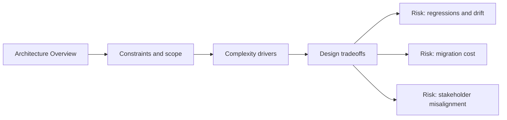

# Architecture Overview

@Metadata {
  @PageKind(article)
  @PageColor(gray)
  @TitleHeading("Architecture Overview")
  @PageImage(purpose: icon, source: "system-designs-system-design-dimensions-icon.codex", alt: "Architecture Overview icon")
  @PageImage(purpose: card, source: "system-designs-system-design-dimensions-card.codex", alt: "Architecture Overview card")
}

@Options {
  @AutomaticSeeAlso(disabled)
}

@Image(source: "system-designs-system-design-dimensions-hero.codex", alt: "Architecture Overview hero")

Describe the system at a high level and show where the hard parts live.

## Include

- Components, responsibilities, and boundaries.
- A short narrative of the core flow.
- Diagram(s) embedded directly in this section when needed.

## Diagram: Context Snapshot

@Image(source: "system-designs-system-design-dimensions-dimensions-architecture-overview-context.mermaid", alt: "Context snapshot")

