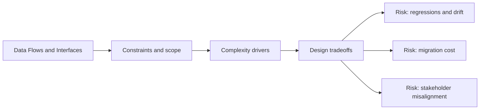

# Data Flows and Interfaces

@Metadata {
  @PageKind(article)
  @PageColor(gray)
  @TitleHeading("Data Flows and Interfaces")
  @PageImage(purpose: icon, source: "system-designs-system-design-dimensions-icon.codex", alt: "Data Flows and Interfaces icon")
  @PageImage(purpose: card, source: "system-designs-system-design-dimensions-card.codex", alt: "Data Flows and Interfaces card")
}

@Options {
  @AutomaticSeeAlso(disabled)
}

@Image(source: "system-designs-system-design-dimensions-hero.codex", alt: "Data Flows and Interfaces hero")

Detail the inputs, outputs, and API contracts that define system boundaries.

## Include

- Key APIs, events, or schemas.
- Data ownership and versioning.
- Backward compatibility expectations.

## Diagram: Context Snapshot

@Image(source: "system-designs-system-design-dimensions-dimensions-data-flows-and-interfaces-context.mermaid", alt: "Context snapshot")

