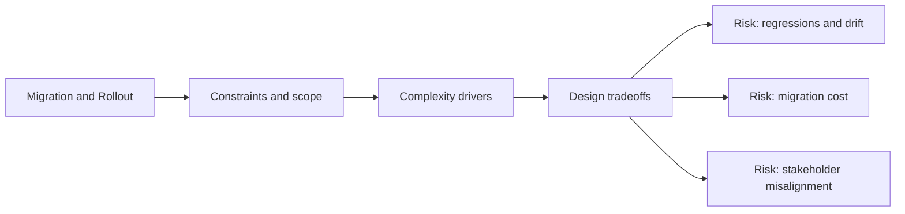

# Migration and Rollout

@Metadata {
  @PageKind(article)
  @PageColor(gray)
  @TitleHeading("Migration and Rollout")
  @PageImage(purpose: icon, source: "system-designs-system-design-dimensions-icon.codex", alt: "Migration and Rollout icon")
  @PageImage(purpose: card, source: "system-designs-system-design-dimensions-card.codex", alt: "Migration and Rollout card")
}

@Options {
  @AutomaticSeeAlso(disabled)
}

@Image(source: "system-designs-system-design-dimensions-hero.codex", alt: "Migration and Rollout hero")

Describe how the new system replaced the old one safely.

## Include

- Rollout stages and feature flagging.
- Backwards compatibility plan.
- Rollback criteria and thresholds.

## Diagram: Context Snapshot

@Image(source: "system-designs-system-design-dimensions-dimensions-migration-and-rollout-context.mermaid", alt: "Context snapshot")

