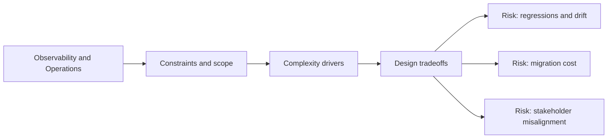

# Observability and Operations

@Metadata {
  @PageKind(article)
  @PageColor(gray)
  @TitleHeading("Observability and Operations")
  @PageImage(purpose: icon, source: "system-designs-system-design-dimensions-icon.codex", alt: "Observability and Operations icon")
  @PageImage(purpose: card, source: "system-designs-system-design-dimensions-card.codex", alt: "Observability and Operations card")
}

@Options {
  @AutomaticSeeAlso(disabled)
}

@Image(source: "system-designs-system-design-dimensions-hero.codex", alt: "Observability and Operations hero")

Describe how the system is monitored and operated day to day.

## Include

- Metrics, logs, and alerts.
- Oncall workflows and playbooks.
- Cost or budget monitoring.

## Diagram: Context Snapshot

@Image(source: "system-designs-system-design-dimensions-dimensions-observability-and-operations-context.mermaid", alt: "Context snapshot")

