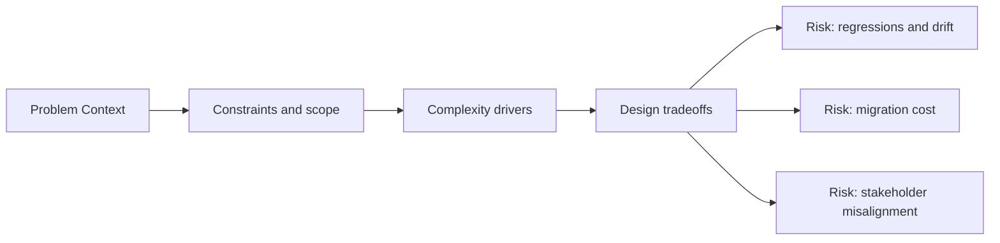

# Problem Context

@Metadata {
  @PageKind(article)
  @PageColor(gray)
  @TitleHeading("Problem Context")
  @PageImage(purpose: icon, source: "system-designs-system-design-dimensions-icon.codex", alt: "Problem Context icon")
  @PageImage(purpose: card, source: "system-designs-system-design-dimensions-card.codex", alt: "Problem Context card")
}

@Options {
  @AutomaticSeeAlso(disabled)
}

@Image(source: "system-designs-system-design-dimensions-hero.codex", alt: "Problem Context hero")

Explain the environment, constraints, and scale that shaped the design.

## Include

- Product surface, users, and workflows.
- Scale, risk, and why the current system was failing.
- What forced a redesign instead of a local fix.

## Diagram: Context Snapshot

@Image(source: "system-designs-system-design-dimensions-dimensions-problem-context-context.mermaid", alt: "Context snapshot")

